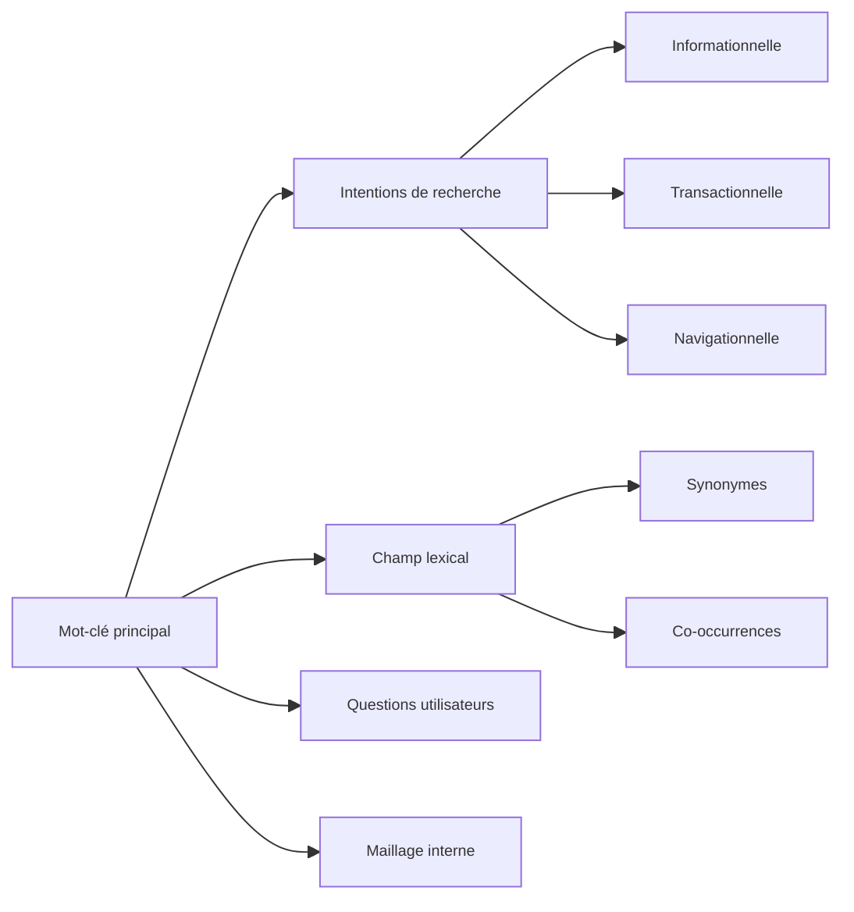

## 1️ Qu’est-ce que le SEO ?

Le **SEO (Search Engine Optimization)**, ou **référencement naturel**, regroupe l’ensemble des techniques visant à améliorer la visibilité d’un site web dans les résultats des moteurs de recherche comme Google, Bing ou Yahoo.

**Objectif :**
Apparaître dans les premiers résultats sur des requêtes pertinentes afin de générer du **trafic qualifié et gratuit**.

---

# 2️ Historique du SEO

## Les débuts (1990 – 2000)

* Apparition des premiers moteurs de recherche : AltaVista, Yahoo.
* Les algorithmes sont simples.
* Le référencement repose principalement sur :

  * La répétition massive de mots-clés (*keyword stuffing*)
  * Les balises meta
  * Les annuaires

Peu de contrôle qualité → manipulation facile.

---

## L’arrivée de Google (1998)

Fondation de Google par Larry Page et Sergey Brin.

Introduction du **PageRank** :

* Analyse des liens entrants
* Popularité basée sur la recommandation

Révolution : le lien externe devient un vote de confiance.

---

## Les grandes mises à jour Google

Google améliore son algorithme pour lutter contre les abus :

* **2011 – Panda** : pénalise le contenu pauvre
* **2012 – Penguin** : lutte contre les liens artificiels
* **2013 – Hummingbird** : compréhension sémantique
* **2015 – Mobile Friendly**
* **2019 – BERT** : compréhension contextuelle avancée
* **2021+ – Core Updates** régulières

Le SEO évolue vers la **qualité**, la **pertinence** et l’**expérience utilisateur**.

---

# 3️ Comment fonctionne un moteur de recherche ?

- Un moteur fonctionne en 3 étapes :

1. **Crawl** : exploration des pages (robots / bots / spiders)

2. **Indexation** : stockage dans une base de données 

3. **Classement (ranking)** : tri selon des centaines de critères 

---

# 4️ - Les 4 piliers du SEO

## Le SEO repose sur 4 fondations majeures

---

# PILIER 1 - Le SEO Technique

* Il permet aux moteurs de **comprendre et indexer** correctement le site.

### Principaux éléments :

* Structure HTML propre
* Balises : `<title>`, `<meta description>`, `<h1>`
* Fichier sitemap.xml (là où les bots peuvent aller)
* Fichier robots.txt (là où les bots ne doivent pas aller)
* Temps de chargement des pages
* Responsive / mobile-first
* Sécurité HTTPS
* Core Web Vitals

### Pourquoi c’est important ?

Même le meilleur contenu ne sera pas référencé si :
* Il est inaccessible
* Il est lent
* Il génère des erreurs 404

---

# PILIER 2 - Le SEO Sémantique

- Il concerne **le contenu et l’intention de recherche**.

Google ne lit plus seulement des mots-clés : il comprend le contexte.

---

## Structure du SEO Sémantique

---

## Explications

### Intentions de recherche

1. **Informationnelle** → "Comment fonctionne le SEO ?"

2. **Transactionnelle** → "Formation SEO en ligne"

3. **Navigationnelle** → "Google Search Console"

---

### Champ lexical

Google analyse :

* Synonymes

* Termes associés

* Expressions liées

Un article SEO doit couvrir un **univers sémantique complet**.

---

### Maillage interne

Relier les pages entre elles permet :

* De distribuer la popularité

* De renforcer la compréhension thématique

* D'améliorer la navigation

---

# PILIER 3 - La Popularité (Netlinking)

- Basé sur les backlinks (liens entrants).

Plus un site reçoit de liens de qualité, plus il gagne en autorité.

### Bon backlink :

* Provenant d’un site fiable
* Dans la même thématique
* Naturel

### Mauvais backlink :

* Spam
* Ferme de liens
* Achat massif artificiel (techniques "black hat")

---

# PILIER 4 - L’Analyse Concurrentielle

- Le SEO n’est pas une discipline isolée.

- On ne cherche pas seulement à être “bon”. On cherche à être **meilleur que les pages déjà positionnées**.

- L’analyse concurrentielle consiste à comprendre :

* Qui est déjà positionné ?

* Pourquoi ces pages sont devant ?

* Quels sont leurs points forts ?

* Où sont leurs faiblesses exploitables ?

---

## Objectifs de l’analyse concurrentielle

1. Identifier les concurrents SEO (souvent différents des concurrents business)

2. Comprendre les standards du marché

3. Détecter les opportunités de positionnement

4. Construire une stratégie différenciante

---

## Construire un avantage stratégique

L’analyse concurrentielle permet de définir :

* Une niche spécifique
* Un angle expert
* Une stratégie long tail
* Une spécialisation thématique forte

## Exemple :

Si tous les concurrents proposent un article généraliste de 800 mots,
vous pouvez proposer :

* Un guide complet de 2500 mots
* Des schémas explicatifs
* Une étude de cas
* Des exemples techniques
* Une FAQ optimisée

---

## Benchmark SEO simplifié

| **Critère**        | **Concurrent A** | **Concurrent B** | **Mon site**    |
| ---------------- | ------------ | ------------ | ----------- |
| Longueur contenu | 1200 mots    | 900 mots     | 2000 mots   |
| Backlinks        | 120          | 80           | 0           |
| Score technique  | Bon          | Moyen        | Excellent   |
| UX               | Correct      | Faible       | À optimiser |

L’objectif : identifier les écarts.

---

# Pourquoi ce pilier est fondamental ?

- Le SEO est un **jeu relatif**.

On ne se positionne pas parce qu’on est bon.
On se positionne parce qu’on est **meilleur que les autres sur une requête donnée**.

### Sans analyse concurrentielle :

* On produit du contenu à l’aveugle
* On sous-estime la difficulté
* On choisit de mauvais mots-clés
* On gaspille du temps

---

# 5 - Point stratégique : l’Expérience Utilisateur (UX)

* **Google analyse aussi :**

* Taux de clic (CTR)

* Temps passé sur la page

* Taux de rebond

* Navigation mobile

* Vitesse de chargement des pages

### Un site agréable pour l'utilisateur améliore indirectement le SEO.

---

# 6 - Les outils SEO incontournables

* **Google Search Console** → suivi indexation

* **Google Analytics / Piwik PRO** → analyse trafic

* **Screaming Frog** SEO Spider → audit technique

* **Semrush** → analyse concurrentielle

* **Ahrefs** → analyse backlinks

---

# 7 - Les tendances SEO actuelles

* SEO mobile-first

* Recherche vocale

* IA générative

* EEAT (Experience, Expertise, Authoritativeness, Trustworthiness) 

* Contenu long format

---

# Conclusion

- Le SEO moderne repose sur :

- Une base technique solide
- Un contenu riche et structuré
- Une stratégie de liens cohérente
- Une excellente expérience utilisateur

Ce n’est plus une discipline purement technique :
C’est un mélange de **marketing, rédaction, data et développement web**.

Une stratégie SEO efficace est toujours basée sur **données + comparaison + différenciation**.

