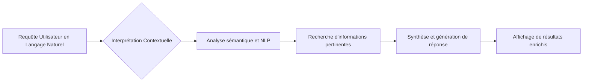

# Article 01-01-01  
## Les moteurs de recherche intègrent des technologies d'IA pour comprendre le contexte et interpréter le langage naturel

### Introduction  
L'évolution des moteurs de recherche est largement marquée par l'intégration des technologies d'intelligence artificielle (IA). Plus précisément, les capacités de compréhension du langage naturel et d'analyse contextuelle transforment profondément la manière dont les moteurs de recherche répondent aux requêtes des utilisateurs. L'objectif n'est plus uniquement de récupérer des documents pertinents, mais de fournir des réponses précises, contextualisées et même synthétisées en temps réel.

---

### 1. Comprendre le langage naturel : une révolution pour la recherche  

Les moteurs traditionnels se basaient essentiellement sur des correspondances exactes de mots-clés, des liens, et des métriques quantitatives (PageRank, densité, fréquence, etc.). L’IA, via des techniques comme les modèles de langage de grande taille (LLM - Large Language Models) ou le NLP (Traitement du Langage Naturel), permet aujourd’hui de :

- **Interpreter la requête en fonction de son contexte** : par exemple, distinguer plusieurs sens d’un même mot selon le contexte (ex : "basse" peut être un instrument ou un terme lié à la taille).  
- **Réécrire la requête en des formulations plus compréhensibles et pertinentes**.  
- **Comprendre la question posée** : en répondant à des questions complexes ou conversationnelles, comme dans les chatbots intégrés aux moteurs de recherche.  

Ces avancées facilitent une interaction plus naturelle entre l’humain et la machine.

---

### 2. Exemples concrets d’intégration de l’IA dans les moteurs de recherche  

#### 2.1 Google et BERT / MUM  
Google a introduit BERT (Bidirectional Encoder Representations from Transformers) en 2019 pour mieux comprendre les nuances du langage naturel. Ce système améliore la compréhension des prépositions, des expressions complexes et des requêtes conversationnelles. Plus récemment, Google a développé MUM (Multitask Unified Model), un modèle encore plus sophistiqué capable de traiter des informations multimodales (texte, images...) et multilingues pour répondre à des requêtes complexes.

#### 2.2 Bing et ChatGPT  
Microsoft Bing a intégré ChatGPT, un chatbot basé sur les LLM de OpenAI, pour fournir des réponses synthétiques et tenant compte du contexte historique des conversations, rendant la recherche plus interactive.

---

### 3. Fonctionnement technique simplifié (diagramme Mermaid)  

---

### 4. Impact et nouveautés 2024  

- **Recherche hybride** : combinaison des résultats classiques avec des réponses générées par IA (résumés, recommandations).  
- **Réécriture automatique des requêtes** : amélioration continue des requêtes utilisateur pour affiner les résultats.  
- **Recherche conversationnelle** : interaction en langage naturel, facilitant les recherches complexes et longues.  
- **Systèmes intelligents autonomes** : évolution vers des IA capables de naviguer et interagir directement avec des ressources externes (fichiers, applications), inaugurant une nouvelle ère du Search.

---

### Sources  

1. [Adjectif 2024 - Serigne - Adjectif.net PDF](https://adjectif.net/IMG/pdf/adjectif-2024-serigne-v2_.pdf)  
2. [Les 4 meilleurs moteurs de recherche IA - Slite.com](https://slite.com/fr/learn/les-4-meilleurs-moteurs-de-recherche-ia-nos-meilleurs-choix-en-2025)  
3. [L'IA décryptée - Devoteam](https://www.devoteam.com/fr/expert-view/lia-decryptee-comprendre-et-utiliser-lintelligence-artificielle-en-2024/)  
4. [La recherche internet à l'heure des LLM - IA-Pulse](https://iapulse.substack.com/p/la-recherche-internet-a-lheure-des)  
5. [Tendances IA 2024 - France-science.com](https://france-science.com/tendances-de-lia-2024-avancees-techniques-actuelles-et-futures-en-matiere-dia-generative-3-4/)  

---

Grâce à ces avancées, la recherche sur Internet devient plus intuitive, plus efficace, et promet une expérience utilisateur enrichie, où la machine comprend véritablement le sens et l’intention de la requête.