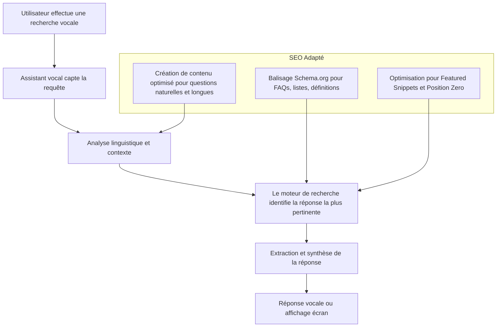

# Article 01-01-02  
## Importance de la recherche conversationnelle et vocale en SEO

### Introduction  
La recherche conversationnelle et vocale s’impose aujourd’hui comme un levier très puissant en SEO. L’émergence des assistants vocaux (Google Assistant, Alexa, Siri), couplée à l’utilisation massive des smartphones, fait évoluer les comportements de recherche : les requêtes deviennent plus longues, plus naturelles, et sous forme de questions. Comprendre cette évolution est nécessaire pour optimiser efficacement une stratégie SEO moderne.

---

### 1. Qu’est-ce que la recherche conversationnelle et vocale ?  

- **Recherche vocale** : utilisation de la voix pour poser une requête à un assistant ou moteur de recherche.  
- **Recherche conversationnelle** : dialogue fluide avec l’IA ou l’assistant, où la machine comprend le contexte, l’historique des échanges, et répond de façon naturelle.

Ces méthodes impliquent une formulation plus naturelle des questions, souvent longues, et plus précises.

---

### 2. Pourquoi la recherche vocale change le SEO ?  

#### 2.1 Nature des requêtes: plus longues et naturelles  
Les utilisateurs ne disent plus seulement "météo Paris". Ils demandent : "Quel temps fera-t-il à Paris demain après-midi ?"  
Cela implique un changement important dans le choix des mots-clés et la structure des contenus SEO. On parle d’optimisation pour le **SEO conversationnel**, qui cible des expressions longues (long-tail keywords) et des questions.

#### 2.2 Réponses précises et rapides attendues  
Les résultats vocaux fournissent souvent une réponse unique et directe (extraits position zéro, featured snippets). Le contenu SEO doit donc être structuré pour répondre clairement et rapidement aux questions, souvent via des FAQ, listes, ou définitions courtes.

---

### 3. Exemples concrets  

- **Alexa ou Google Home** répondent souvent avec la réponse la plus concise et exacte, s’appuyant sur des balisages structurés et du contenu optimisé.  
- Des sites e-commerce ajoutent des sections FAQ ciblées "Quels sont les délais de livraison...?" pour capter le trafic vocal.  
- Le contenu de blog se concentre sur des questions fréquentes formulées comme dans une conversation naturelle.

---

### 4. Schéma simplifié du processus SEO adapté à la recherche vocale et conversationnelle  

---

### 5. Enjeux en 2024 et bonnes pratiques  

- **Prioriser les contenus conversationnels** : intégrer des questions-réponses précises dans vos contenus.  
- **Utiliser le balisage structuré** (Schema.org) pour permettre aux moteurs de comprendre le contenu sous forme de FAQ, How-to, etc.  
- **Optimiser pour le Featured Snippet** : résumer les réponses dans des paragraphes courts ou listes à puces.  
- **Adapter le SEO local** : la recherche vocale est souvent locale ("où trouver un restaurant italien près de moi ?").  
- **Analyser les requêtes vocales** grâce aux outils comme Google Search Console pour identifier les questions fréquentes.

---

### Sources  

- [Le SEO conversationnel : optimiser votre contenu en 2026 – Le Blog du Dirigeant](https://www.leblogdudirigeant.com/le-seo-conversationnel/)  
- [Pourquoi intégrer la recherche vocale dans votre stratégie SEO – MARcomET (2024)](https://www.marcomet.be/pourquoi-integrer-la-recherche-vocale-dans-votre-strategie-seo-est-primordial/)  
- [Tendances SEO 2024 : Stratégies, IA & Recherche Vocale – Beavers](https://beavers-agency.fr/la-pause-cafe/seo/tendances-seo-2024-strategies-ia-recherche-vocale-ethique)  
- [L'importance du voice search pour le SEO en 2024 – BienveNum](https://bienvenum.org/limportance-du-voice-search-pour-le-seo-en-2024/)  
- [Recherche vocale et SEO, enjeux et impacts – Foxglove Partner](https://foxglove-partner.com/recherche-vocale-et-seo/)  

---

La recherche vocale et conversationnelle transforme la manière dont le contenu doit être pensé et structuré pour capter un trafic qualifié. En adoptant une stratégie SEO adaptée, fondée sur la compréhension du langage naturel et l’optimisation des réponses rapides, les sites web exploitent pleinement ces nouveaux modes d’interaction utilisateur.