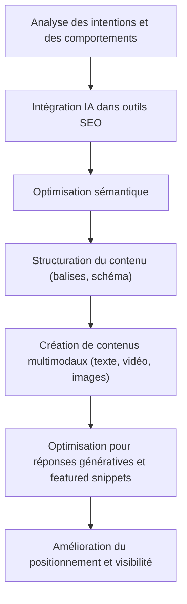

# Article 01-02-01  
## Adaptation des stratégies SEO pour répondre aux exigences de l'IA

### Introduction  
L’intelligence artificielle (IA) bouleverse les pratiques SEO traditionnelles à mesure qu’elle s’intègre dans les moteurs de recherche, notamment avec l’émergence des réponses génératives (ex : Search Generative Experience de Google). Cette transformation impose aux spécialistes du référencement naturel d’adapter leurs stratégies pour rester visibles, performants et pertinents face à ces nouvelles exigences.

---

### 1. Vers un SEO centré sur l’intention utilisateur et les réponses génératives  

Les moteurs de recherche utilisent désormais l’IA pour analyser non seulement des mots-clés, mais aussi le contexte et l’intention derrière chaque requête. Par conséquent, le SEO doit :

- **Comprendre finement l’intention de recherche** (informationnelle, transactionnelle, navigationnelle).  
- **Adapter les contenus** pour apporter des réponses complètes, précises et bien structurées afin d’être sélectionnés pour les "featured snippets" ou réponses vocales.  
- **Développer des contenus multimodaux** (texte, vidéo, images) répondant aux attentes modernes des utilisateurs.

---

### 2. Exploiter l’IA pour mieux anticiper les attentes  

L’IA permet d’analyser en profondeur les données comportementales et les tendances de recherche. Les outils intelligents suggèrent des thématiques à développer, optimisent sémantiquement les contenus et préconisent des améliorations techniques SEO.

**Exemple :** Pour un article sur les voitures électriques, l’IA suggérera d’aborder des sujets comme l’empreinte carbone des batteries ou les défis liés à l’extraction du lithium, en phase avec ce que cherchent réellement les internautes.

---

### 3. Les bonnes pratiques SEO à adopter face aux exigences de l’IA  

- **Structurer le contenu avec soin** : balises HTML, titres, listes à puces et paragraphes courts favorisent la compréhension par les systèmes d’IA.  
- **Utiliser le balisage sémantique (Schema.org)** pour guider les moteurs de recherche sur la nature des informations (FAQ, HowTo, avis, événements).  
- **Privilégier le SEO conversationnel** : anticiper les questions naturelles, longues et conversationnelles.  
- **Mettre l’accent sur la qualité et la fiabilité** du contenu, car l’IA valorise les sources crédibles et originales.  
- **Optimiser pour le Search Generative Experience (SGE)** en proposant des contenus structurés qui facilitent la génération automatique de réponses par l’IA.

---

### 4. Exemple d’adaptation stratégique  

Une boutique e-commerce souhaitant se positionner en SEO peut :  
- Rédiger des fiches produits enrichies avec des sections FAQ optimisées.  
- Créer des tutoriels vidéo intégrés pour enrichir le contenu multimodal.  
- Mettre en place des balises structurées pour permettre à l’IA de générer des réponses précises dans les assistants vocaux ou résultats enrichis.

---

### 5. Schéma Mermaid illustrant l’adaptation SEO face à l’IA  

---

### Sources  

- [SEO en 2024 : Chiffres clés, tendances et IA - Extencia](https://www.extencia.fr/seo-en-2024-chiffres-cles-tendances-et-ia)  
- [SEO 2024 : 5 stratégies clés pour dompter l'IA - Daware.io](https://www.daware.io/seo/attention-lia-bouleverse-seo-2024-voici-5-strategies-adopter-durgence/)  
- [L'IA révolutionne le SEO : Opportunités et limites - In Data Veritas](https://in-data-veritas.com/lia-revolutionne-le-seo-opportunites-et-limites-pour-la-generation-de-contenu-en-2024/)  
- [IA et SEO : les clés pour s’adapter - E-marketing.fr](https://www.e-marketing.fr/brandvoice/ia-et-seo-les-cles-pour-sadapter-a-la-nouvelle-ere)  
- [Google : Les nouveaux défis du SEO avec l'IA en 2024 - e-maj](https://www.emajweb.com/blog/google-intelligence-artificielle-seo-2024/)

---

En résumé, intégrer l’IA dans la stratégie SEO, c’est anticiper les besoins des utilisateurs en produisant des contenus riches, parfaitement structurés et adaptés à des interfaces de recherche qui privilégient désormais des réponses génératives, synthétiques, et contextuelles.
