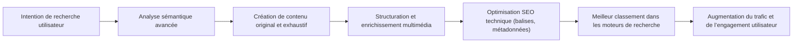

# Article 01-02-02  
## Focus sur la création de contenu de haute qualité et la recherche sémantique

### Introduction  
La création de contenu de haute qualité et la recherche sémantique sont deux piliers incontournables pour optimiser son référencement naturel (SEO) en 2024. Les moteurs de recherche sont désormais capables de comprendre non seulement les mots clés, mais aussi le contexte global des contenus et l’intention des utilisateurs, grâce aux avancées de l’Intelligence Artificielle et des algorithmes sémantiques. Il est donc nécessaire d’adopter une approche qui combine qualité rédactionnelle et optimisation contextuelle.

---

### 1. Contenu de haute qualité : les critères à respecter en 2024  

Un contenu de haute qualité répond aux exigences suivantes :  

- **Originalité** : éviter le contenu dupliqué, proposer un point de vue ou des informations uniques qui apportent une vraie valeur ajoutée.  
- **Pertinence et exhaustivité** : répondre précisément à l’intention de recherche, couvrir un sujet dans sa globalité.  
- **Lisibilité et structure** : organisation claire du texte avec des titres, sous-titres, listes, paragraphes courts pour faciliter la lecture.  
- **Multimédia pertinent** : intégrer des images, vidéos, infographies pour illustrer le contenu et améliorer l’expérience utilisateur.  
- **Optimisation SEO** : balises meta, mots-clés stratégiques intégrés naturellement dans le texte.  

**Exemple :** Un guide complet sur l'entretien d'une voiture électrique qui détaille les différentes étapes, les outils nécessaires, la fréquence recommandée, et inclut des vidéos tutorielles aura plus de chances de bien se positionner qu’un texte superficiel.

---

### 2. Recherche sémantique : comprendre au-delà des mots-clés  

La recherche sémantique ne se limite plus à repérer les mots-clés exacts dans une page. Elle consiste à :  

- **Comprendre le sens et l’intention** derrière une requête.  
- **Analyser le contexte global du contenu** pour vérifier sa cohérence thématique.  
- **Reconnaître les synonymes, expressions connexes et variantes** qui enrichissent le champ lexical.  

Cela signifie que les moteurs de recherche valorisent les contenus qui répondent pleinement aux besoins des utilisateurs, même si les mots utilisés ne correspondent pas textuellement à leur requête.

---

### 3. Mise en pratique : comment intégrer la sémantique dans votre contenu ?  

- **Utiliser des outils d’analyse sémantique** comme SEMrush, 1.fr, ou YourTextGuru pour enrichir votre contenu avec des mots et expressions connexes.  
- **Produire des contenus thématiques complets** plutôt que de se limiter à un mot-clé unique.  
- **Répondre aux questions implicites** autour du sujet traité (FAQ intégrées).  
- **Penser au champ lexical et à la cohérence interne** dans les articles.  

---

### 4. Diagramme Mermaid illustrant l’intégration du contenu de qualité et de la recherche sémantique  

---

### 5. Exemples concrets  

- **Cas d’une entreprise de santé** : création d’un contenu complet sur « la gestion du diabète » intégrant non seulement les symptômes, traitements, mais aussi les questions fréquentes, le régime alimentaire, et les dernières recherches médicales, optimisé avec une sémantique riche autour des termes liés (glucose, insuline, complications, mode de vie).  
- **Blog voyage** : au lieu de se focaliser sur « voyage Thaïlande », un contenu sémantiquement riche évoquera aussi la culture locale, les spécialités culinaires, les précautions sanitaires, et les itinéraires recommandés, répondant ainsi à un spectre plus large d’intentions.

---

### Sources utilisées  

- [SEO : quels critères influencent le classement de Google en 2024 ? - Blog du Modérateur](https://www.blogdumoderateur.com/seo-criteres-classement-google-2024/)  
- [5 principales tendances SEO en 2024 - Affluences](https://www.affluences.ca/blogue/5-principales-tendances-seo-en-2024/)  
- [Pourquoi la sémantique est-elle primordiale en SEO en 2024 - Spread Communication](https://spread-communication.com/blog/semantique-primordiale-seo/)  
- [Mots-clés en 2024 : vers un SEO plus sémantique - Neper.fr](https://www.neper.fr/2024/01/31/mots-cles-en-2024-vers-un-seo-plus-semantique-1-2/)  
- [Les principaux facteurs de classement SEO en 2024 - Digital HEC](https://digital.hec.ca/blog/les-principaux-facteurs-de-classement-seo-en-2024/)  

---

L’alliance du contenu qualitatif et de la recherche sémantique permet d’adresser pleinement les attentes des moteurs de recherche modernes. Ce double levier améliore la visibilité, la pertinence, et l’expérience utilisateur, ingrédients clés pour un SEO performant en 2024.
