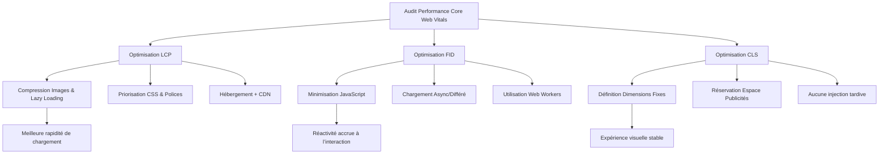

# Article 02-01-01  
## Optimisation de la vitesse avec Core Web Vitals

### Introduction  
La vitesse de chargement d'un site web ne se limite plus à une simple question d’expérience utilisateur : elle influence directement le référencement naturel (SEO). Google a officiellement intégré les **Core Web Vitals** (signaux Web essentiels) parmi ses critères de classement depuis 2021. Ces indicateurs mesurent la qualité de l’expérience utilisateur en se concentrant sur la rapidité, l’interactivité et la stabilité visuelle lors du chargement d’une page. 

---

### 1. Comprendre les Core Web Vitals

Les Core Web Vitals se composent de trois métriques principales :

- **Largest Contentful Paint (LCP)** : mesure le temps nécessaire pour afficher le plus grand élément visible (texte, image). Un bon LCP doit se situer sous 2,5 secondes.  
- **First Input Delay (FID)** : mesure la réactivité lors de la première interaction de l'utilisateur (clic, tap, saisie). Un bon FID est inférieur à 100 millisecondes.  
- **Cumulative Layout Shift (CLS)** : quantifie la stabilité visuelle, c’est-à-dire les décalages inattendus des éléments pendant le chargement. Un bon CLS est inférieur à 0,1.

Ces trois indicateurs sont fondamentaux pour évaluer la performance perçue et réelle d’une page.

---

### 2. Pourquoi optimiser Core Web Vitals pour le SEO ?

Google privilégie les sites offrant une expérience fluide et rapide, car cela réduit les taux de rebond et améliore l’engagement.  

- Un **LCP rapide** permet aux visiteurs de voir rapidement le contenu principal.  
- Un **FID faible** assure une interaction immédiate, sans délai frustrant.  
- Un **CLS bas** évite des perturbations visuelles qui peuvent causer des erreurs de clic ou un ressenti de page non professionnelle.  

En 2024, ces critères demeurent incontournables dans l’algorithme de Google, et une mauvaise performance peut coûter des positions dans les résultats de recherche.

---

### 3. Techniques pour optimiser les Core Web Vitals

#### 3.1 Améliorer le LCP  
- Optimiser la taille et le format des images (WebP, compression).  
- Utiliser le **lazy loading** pour différer le chargement des images hors écran.  
- Prioriser le chargement des ressources critiques (CSS, polices).  
- Minimiser le temps de réponse serveur (hébergement performant, CDN).

#### 3.2 Réduire le FID  
- Réduire le poids et la complexité des fichiers JavaScript.  
- Découper les tâches longues, charger le JS de manière asynchrone ou différée.  
- Utiliser les Web Workers pour les opérations complexes hors-thread principal.

#### 3.3 Diminuer le CLS  
- Définir dans le CSS des dimensions fixes pour les images et vidéos.  
- Réserver de l’espace pour les publicités et éléments dynamiques.  
- Éviter l’injection tardive de contenu ou récits publicitaires invisibles par défaut.

---

### 4. Exemple concret d’optimisation  

Un site e-commerce avec une page produit lourde a vu son **LCP passer de 5 secondes à 2 secondes** après :  
- Conversion des images JPG en WebP.  
- Mise en place du lazy loading des images secondaires.  
- Optimisation des fichiers CSS avec suppression des styles inutilisés.  
- Passage à un hébergement optimisé.

Résultat : augmentation du taux de conversion de 12% grâce à une meilleure expérience utilisateur.

---

### 5. Diagramme Mermaid – Optimisation Core Web Vitals

---

### Sources  

- [Core Web Vitals - Google Developers](https://web.dev/vitals/)  
- [Google Search Central - Page Experience](https://developers.google.com/search/blog/2021/05/evaluating-page-experience)  
- [Comprendre et optimiser Core Web Vitals – Semrush Blog](https://fr.semrush.com/blog/core-web-vitals-2024-optimisation-seo/)  
- [Optimiser la vitesse web avec Core Web Vitals – Ahrefs Blog](https://ahrefs.com/blog/core-web-vitals/)  
- [Les signaux Web essentiels, en pratique – Moz](https://moz.com/blog/core-web-vitals-what-you-need-to-know)  

---

L’optimisation des Core Web Vitals est une étape clé dans la stratégie SEO technique avancée. Travailler sur la performance, la réactivité, et la stabilité visuelle permet d’améliorer notablement l’expérience utilisateur et la visibilité dans les moteurs de recherche.