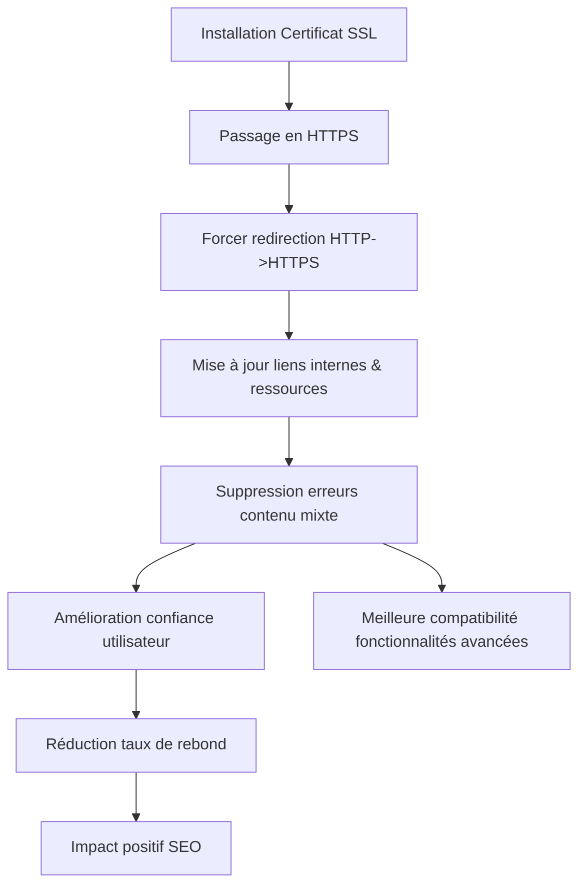

# Article 02-01-02  
## Gestion de la sécurité avec certificats SSL

### Introduction  
La sécurité d’un site web est aujourd’hui un facteur majeur de confiance pour les utilisateurs et un critère de référencement. La gestion des certificats SSL (Secure Sockets Layer), qui garantissent la sécurisation des échanges de données entre le navigateur et le serveur, est devenue incontournable. Google valorise les sites sécurisés HTTPS dans son algorithme, impactant directement le SEO.

---

### 1. Qu’est-ce qu’un certificat SSL et pourquoi est-il indispensable ?

Un certificat SSL authentifie l’identité d’un site web et chiffre les données échangées, empêchant leur interception ou modification frauduleuse. Il garantit :  
- **Confidentialité** : protège les données sensibles (informations personnelles, mots de passe, paiement).  
- **Intégrité** : les données ne peuvent être altérées durant le transit.  
- **Authentification** : certifie que l’utilisateur communique bien avec le site légitime.

Depuis 2014, Google Chrome marque explicitement les sites non sécurisés en HTTP comme "Non sécurisé", ce qui peut décourager les visiteurs.

---

### 2. Impact SEO des certificats SSL  

Google considère le passage au HTTPS comme un signal positif de classement, même si son poids reste modéré par rapport au contenu ou à la pertinence. Le HTTPS :  
- Améliore la confiance des utilisateurs, réduisant le taux de rebond.  
- Facilite l’accès à des fonctionnalités avancées (AMP, HTTP/2, Progressive Web Apps).  
- Est souvent requis pour apparaître dans certains résultats enrichis.

---

### 3. Types de certificats SSL  

- **Domain Validation (DV)** : valide que le domaine est bien contrôlé par le demandeur. Installation rapide, convient aux blogs et petits sites.  
- **Organization Validation (OV)** : vérifie aussi l’organisation derrière le site, adaptée aux entreprises ayant besoin d’une preuve supplémentaire.  
- **Extended Validation (EV)** : la plus stricte, ouvre une barre d’adresse verte (certains navigateurs) avec le nom de l’entreprise, destinée aux sites exposés à des risques élevés.

---

### 4. Bonnes pratiques pour gérer un certificat SSL efficacement  

- **Installer un certificat SSL valide et à jour** via une autorité reconnue (ex : Let’s Encrypt, DigiCert).  
- **Forcer la redirection de tout le trafic HTTP vers HTTPS** avec une redirection 301 pour éviter les contenus dupliqués.  
- **Mettre à jour toutes les ressources internes** (images, scripts, liens) pour utiliser HTTPS et éviter les erreurs de contenu mixte.  
- **Surveiller l’expiration du certificat** et renouveler avant la date limite pour éviter les alertes sur le site.  
- **Configurer les en-têtes de sécurité HTTP** (HSTS, CSP) pour renforcer la protection.

---

### 5. Exemple concret d’application  

Un site d’e-commerce a basculé d’HTTP à HTTPS :  
- Mise en place d’un certificat Let’s Encrypt gratuit avec automatisation du renouvellement.  
- Réécriture des URLs pour forcer le HTTPS.  
- Correction des liens internes pour éviter les avertissements de contenu mixte.  
- Résultat : baisse du taux de rebond de 8% et amélioration de la position moyenne dans Google sur des mots-clés concurrentiels.

---

### 6. Diagramme Mermaid – Gestion SSL et impact SEO  

---

### Sources  

- [Google Search Central : HTTPS as a ranking signal](https://developers.google.com/search/blog/2014/08/https-as-ranking-signal)  
- [Let’s Encrypt – Guide d’installation SSL](https://letsencrypt.org/fr/getting-started/)  
- [SSL en SEO : Pourquoi et comment ? - Semrush Blog](https://fr.semrush.com/blog/ssl-seo/)  
- [Certificats SSL : comment choisir ? - DigiCert](https://www.digicert.com/fr/fr/ssl/)  
- [Guide sécurité HTTP headers (HSTS, CSP) - Mozilla](https://developer.mozilla.org/fr/docs/Web/HTTP/Headers)  

---

La gestion rigoureuse des certificats SSL ne protège pas seulement les utilisateurs, elle contribue aussi à un référencement naturel optimisé en apportant sécurité, confiance et conformité aux attentes des moteurs de recherche modernes.