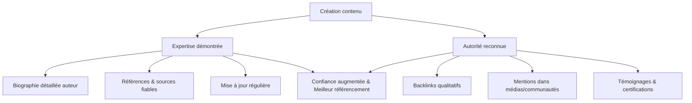

# Article 02-02-01  
## Renforcer l'expertise et l'autorité du contenu pour le SEO EEAT

### Introduction  
Le concept **EEAT** (Expertise, Authoritativeness, Trustworthiness) est un cadre utilisé par Google pour évaluer la qualité des contenus, notamment dans les secteurs dits *Your Money or Your Life* (YMYL) – finance, santé, juridique. Renforcer l’expertise et l’autorité d’un contenu est devenu un levier déterminant pour améliorer son positionnement dans les résultats de recherche. Cet article explicite comment structurer et prouver cette expertise afin de répondre aux critères d’EEAT.

---

### 1. Comprendre le rôle de l’expertise et de l’autorité dans EEAT  

- **Expertise** : se manifeste par la compétence réelle ou démontrée du créateur de contenu sur un sujet donné, souvent via des qualifications, expériences ou compétences spécifiques.  
- **Autorité** : la reconnaissance par les pairs ou la communauté (liens entrants, mentions, citations, compétences reconnues dans le domaine), qui valide la fiabilité et la valeur du contenu.

Google valorise les contenus créés par des experts identifiables, crédibles et reconnus, pour garantir aux utilisateurs des réponses fiables.

---

### 2. Comment renforcer l’expertise dans votre contenu  

- **Mentionner clairement l’auteur** avec biographie détaillée mentionnant ses qualifications, expériences et références liées au sujet (ex : diplômes, certifications professionnelles).  
- **Inclure des références et sources crédibles** dans le texte, citant des études, publications ou sites reconnus.  
- **Mettre à jour régulièrement les contenus** pour conserver leur pertinence et qualité à jour, particulièrement critique dans les domaines techniques ou médicaux.  
- **Adopter un langage précis et technique** quand cela est approprié, montrant la maîtrise du sujet.  
- **Utiliser des formats adaptés** : articles longs, guides détaillés, études de cas, livres blancs…  

---

### 3. Construire et afficher l’autorité  

- **Obtenir des backlinks de qualité** provenant de sites reconnus dans le secteur, médias, institutions académiques.  
- **Encourager les mentions sociales et citations** sur d’autres plateformes conformes.  
- **Valoriser les avis et témoignages clients ou externes** vérifiables.  
- **Mettre en avant les partenariats ou certifications officielles**.  
- Sur le plan technique, utiliser le balisage Schema.org pour les auteurs (Person), les critiques (Review), ou les articles (Article) pour faciliter la reconnaissance par les moteurs.

---

### 4. Exemples concrets  

- Un site médical présente l’article avec une fiche auteur exhaustive : le médecin rédacteur est identifié avec diplômes, affiliations hospitalières et publications scientifiques. Des liens vers des études médicales validées sont intégrés dans le contenu.  
- Un blog financier obtient des backlinks de sites d’autorité économique et incorpore des témoignages d’experts financiers reconnus, tout en mettant à jour constamment les analyses en fonction des évolutions réglementaires.

---

### 5. Schéma Mermaid illustrant la construction EEAT  

---

### Sources  

- [Google Search Central - Évaluer la qualité du contenu](https://developers.google.com/search/blog/2022/08/helpful-content-update)  
- [Guide EEAT 2024 – Moz](https://moz.com/blog/google-eat-guide)  
- [Comprendre et appliquer EEAT pour le SEO - Semrush Blog](https://www.semrush.com/blog/what-is-e-e-a-t-google/)  
- [Le rôle de l’EEAT dans le référencement en 2024 - Search Engine Journal](https://www.searchenginejournal.com/google-e-e-a-t-update/485272/)  
- [Schema.org – Balisage des auteurs et articles](https://schema.org/Person)  

---

Renforcer l’expertise et l’autorité dans vos contenus ne repose pas seulement sur la rédaction, mais sur une stratégie globale associant transparence, preuve sociale et qualité. La reconnaissance de ces éléments par les moteurs de recherche impacte positivement le SEO et la confiance des utilisateurs.