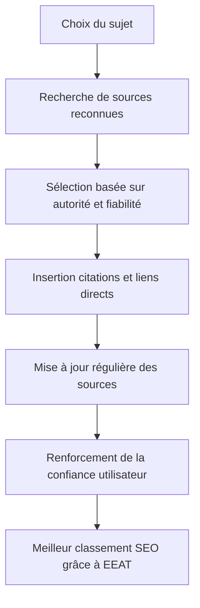

# Article 02-02-02  
## Construire la confiance avec des sources crédibles et sûres

### Introduction  
Dans le cadre de l’évaluation EEAT (Expertise, Authoritativeness, Trustworthiness) des contenus web, **la confiance** est un élément central. Google s’appuie de plus en plus sur la qualité des sources citées pour valoriser les pages dans ses résultats, surtout dans les domaines YMYL (*Your Money or Your Life*). Utiliser des sources crédibles et sûres est donc indispensable pour asseoir cette confiance auprès des moteurs et des utilisateurs.

---

### 1. Qu’est-ce qu’une source crédible et sûre ?  

Une source crédible se caractérise par :  

- **L’autorité reconnue** : institutions, experts reconnus, publications scientifiques, sites officiels.  
- **La fiabilité des informations** : données factuelles, contrôlées, à jour, et vérifiables.  
- **La transparence** : clarté sur l’origine de l’information, absence d’intérêts conflictuels.  

Des sites comme les organisations gouvernementales, universités, ONG reconnues, ou revues scientifiques, constituent des références sûres.

---

### 2. Importance des sources fiables dans le SEO et EEAT  

Google prend en compte la qualité des références utilisées pour :  

- Confirmer la **véracité des informations**.  
- Évaluer la **transparence et la rigueur éditoriale**.  
- Réduire la diffusion de contenu **erroné ou trompeur**.  

Les pages faisant appel à des sources peu fiables ou étrangères à leur thématique verront leur référencement affaibli. À l’inverse, citer des sources de haut niveau améliore la perception d’autorité et de confiance.

---

### 3. Comment intégrer des sources crédibles et sûres dans ses contenus ?

- **Préférer les sources reconnues** (ex : agences gouvernementales comme Santé Publique France, publications universitaires, médias reconnus).  
- **Indexer les citations précises et contextualisées** en insérant des liens hypertextes directs vers les documents originaux.  
- **Utiliser des données récentes** pour maintenir l’actualité.  
- **Éviter les sources non vérifiées**, les forums anonymes ou sites douteux.  
- **Mentionner clairement les sources** en fin d’articles ou dans des notes de bas de page.  

---

### 4. Exemple concret  

Un site traitant de nutrition :  

- Citer des études récentes publiées dans des revues scientifiques reconnues (ex : *The Lancet*, *Journal of Nutrition*).  
- Lier ces citations vers les documents originaux ou bases de données comme PubMed.  
- Ajouter une bibliographie ou section "Sources" détaillant toute la documentation utilisée.  

Cela inspire confiance, assure la conformité EEAT et rassure le lecteur quant à la fiabilité des conseils donnés.

---

### 5. Diagramme Mermaid – Processus d’intégration de sources fiables  

---

### Sources  

- [Google Search Central - Content quality and EEAT](https://developers.google.com/search/docs/appearance/e-e-a-t)  
- [How to Build Trustworthy Content for SEO - Moz](https://moz.com/blog/trustworthy-content-seo)  
- [Citing credible sources in SEO content - SEMrush](https://www.semrush.com/blog/trustworthiness-seo/)  
- [The importance of credible sources in YMYL content - Search Engine Journal](https://www.searchenginejournal.com/google-ymyl-ranking-signal/431317/)  
- [Evaluating source credibility - Nielsen Norman Group](https://www.nngroup.com/articles/credibility/)  

---

Construire la confiance par l’usage de sources crédibles et sûres répond aux exigences du référencement moderne. Cette démarche améliore la fiabilité perçue du site, l’expérience utilisateur et la performance SEO, en particulier pour les thématiques sensibles où la rigueur est primordiale.