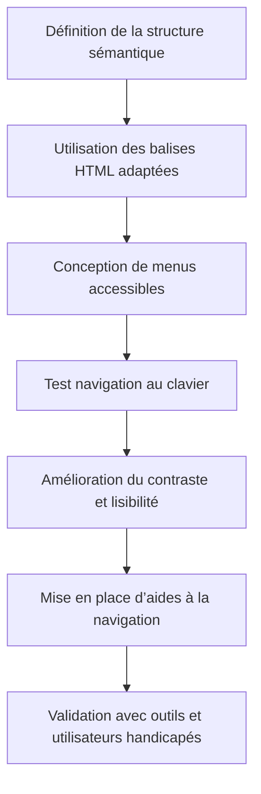

# Article 03-01-01  
## Techniques pour une navigation intuitive et accessible à tous

### Introduction  
L’accessibilité web vise à rendre les sites utilisables par tous, y compris les personnes en situation de handicap (visuel, moteur, auditif, cognitif). Une navigation intuitive et accessible améliore l’expérience utilisateur, favorise l’inclusion et participe positivement au référencement naturel SEO.

---

### 1. Principes d’une navigation accessible  

- **Clarté** : menu simple, labels explicites, structure logique.  
- **Cohérence** : interface homogène sur toutes les pages, mêmes repères et éléments de navigation.  
- **Simplicité** : éviter la surcharge d’éléments, privilégier des chemins directs.  
- **Adaptabilité** : navigation utilisable avec clavier uniquement, lecteurs d’écran, ou appareils mobiles.  

---

### 2. Techniques concrètes pour rendre la navigation accessible  

#### 2.1 Utilisation correcte des balises HTML sémantiques  
Les balises `<nav>`, `<header>`, `<main>`, `<footer>` structurent le contenu et aident les technologies d’assistance à interpréter la page.  

#### 2.2 Navigation au clavier  
- Permettre de tabuler facilement entre les éléments interactifs (liens, boutons).  
- Assurer un ordre logique de navigation au clavier.  
- Afficher des focus visibles pour guider l’utilisateur.  

#### 2.3 Menus clairs et accessibles  
- Utiliser des menus déroulants accessibles via clavier et technologies d’assistance.  
- Fournir des alternatives textuelles et indications d’état (ex : `aria-expanded`).  

#### 2.4 Contraste des couleurs et lisibilité  
- Respecter un ratio minimum de contraste (4.5:1 pour texte normal).  
- Proposer des options de taille de police ajustable sans rupture de mise en page.  

#### 2.5 Aides à la navigation  
- Fil d’Ariane (breadcrumb) pour situer l’utilisateur dans l’arborescence.  
- Liens “Retour en haut de page”, sommaire cliquable.  

---

### 3. Exemples concrets  

- Le site **BBC** a une navigation simple, utilise des menus bien labellisés et offre une navigation clavier fluide.  
- Le site **GOV.UK** structure ses pages avec des balises ARIA et possède un fil d’Ariane clair, facilitant la compréhension de la hiérarchie.  

---

### 4. Diagramme Mermaid – Processus pour une navigation accessible

---

### 5. Outils et ressources pour tester l’accessibilité  

- **WAVE** (Web Accessibility Evaluation Tool) : analyse visuelle de l’accessibilité.  
- **axe Accessibility checker** (extension navigateur) : détection automatique des erreurs.  
- **NVDA**, **VoiceOver** : lecteurs d’écran pour tester l’expérience utilisateur.  
- **Lighthouse** intégré dans Chrome : audit complet incluant accessibilité.  

---

### Sources  

- [WCAG 2.1 Guidelines - W3C](https://www.w3.org/TR/WCAG21/)  
- [Mozilla Developer Network - Accessible navigation](https://developer.mozilla.org/en-US/docs/Web/Accessibility/Keyboard-navigable_JavaScript_widgets)  
- [BBC Accessibility Guidance](https://www.bbc.co.uk/accessibility/)  
- [GOV.UK Design System - Navigation](https://design-system.service.gov.uk/patterns/navigation/)  
- [WebAIM - Keyboard Accessibility](https://webaim.org/techniques/keyboard/)  
- [Google Lighthouse Accessibility](https://developers.google.com/web/tools/lighthouse/audits/accessibility)  

---

Adopter ces techniques transforme la navigation d’un site en une expérience fluide, inclusive et conforme aux standards, améliorant à la fois l’usage pour tous et le référencement naturel.