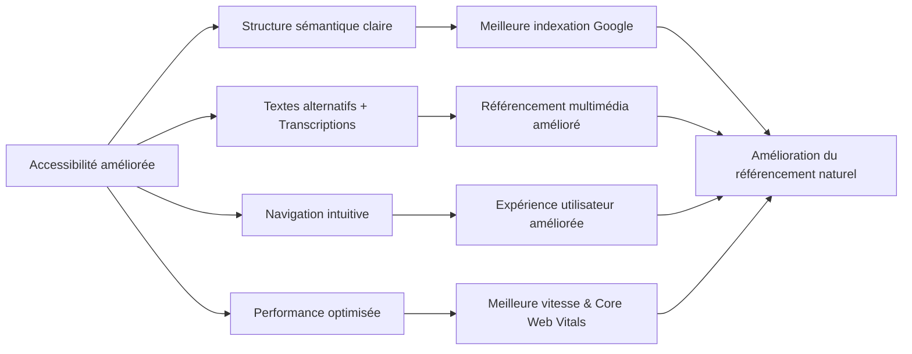

# Article 03-01-02  
## Impact de l'accessibilité sur le référencement naturel

### Introduction  
L’accessibilité web ne vise pas seulement à rendre les sites utilisables par toutes les personnes, y compris celles en situation de handicap, mais elle influence aussi fortement le référencement naturel (SEO). Google valorise les sites offrant une expérience utilisateur optimale, compréhensible et utilisable par tous, ce qui fait de l’accessibilité un levier SEO incontournable.

---

### 1. Comment l'accessibilité améliore le référencement naturel  

#### 1.1 Structure claire et sémantique du contenu  
Les balises HTML sémantiques utilisées pour améliorer l’accessibilité (ex : `<header>`, `<nav>`, `<article>`, `<main>`) facilitent l’indexation par les moteurs en clarifiant la hiérarchie et la pertinence du contenu. Les lecteurs d’écran et Googlebot comprennent mieux la page, ce qui peut augmenter la visibilité.  

#### 1.2 Textes alternatifs et contenu multimédia  
Les attributs **alt** sur les images et les transcriptions des vidéos permettent à Google d’indexer correctement ces contenus, améliorant ainsi la diversité des résultats (dans Google Images par exemple) et la compréhension globale de la page.  

#### 1.3 Navigation optimisée  
Une navigation accessible, avec un ordre logique de tabulation et des menus clairs, permet une meilleure exploration du site par les crawlers et une meilleure expérience utilisateur, ce qui réduit le taux de rebond, un facteur indirect mais important de SEO.  

#### 1.4 Vitesse et performance  
Les bonnes pratiques d’accessibilité sont souvent associées à une optimisation de la performance (ex : éviter les scripts bloquants, simplifier le code), ce qui impacte positivement le SEO via Core Web Vitals.

---

### 2. Exemples de bénéfices SEO liés à l’accessibilité  

- Un site e-commerce ayant amélioré ses attributs alt et utilisé des balises ARIA a constaté une hausse de 15% de son trafic organique via Google Images.  
- Un blog d’information médicale, en structurant ses articles avec des titres clairs et une navigation intuitive, a vu son taux de rebond diminuer, aidant à consolider ses positions dans les résultats.  

---

### 3. Risques SEO liés au manque d’accessibilité  

- Contenu non sémantique ou mal balisé provoque une indexation incomplète.  
- Absence d’attributs alt ou contenu multimédia non décrit empêche le référencement de ces éléments.  
- Navigation confuse accroît le taux de rebond.  

Ces insuffisances peuvent pénaliser la visibilité et la crédibilité du site.

---

### 4. Diagramme Mermaid – Corrélation Accessibilité et SEO  

---

### 5. Ressources et outils pour mesurer et optimiser  

- **Google Lighthouse** (audit accessibilité + performance).  
- **axe Accessibility** (extension navigateur).  
- **WAVE** (analyse d’accessibilité visuelle).  
- **Google Search Console** : suivi des performances et erreurs d’indexation.  

---

### Sources  

- [Google Developers – Accessibility and SEO](https://developers.google.com/search/docs/appearance/accessibility)  
- [Web Accessibility Initiative (WAI) - Impact on SEO](https://www.w3.org/WAI/business-case/)  
- [Moz – SEO and Accessibility](https://moz.com/blog/seo-accessibility-ux)  
- [Search Engine Journal – How Accessibility Impacts SEO](https://www.searchenginejournal.com/accessibility-and-seo/334395/)  
- [WebAIM – Accessibility and SEO](https://webaim.org/articles/seo/)  

---

Améliorer l’accessibilité optimise en parallèle la compréhension par les moteurs de recherche et l’expérience utilisateur, deux leviers essentiels pour un référencement naturel performant et durable.