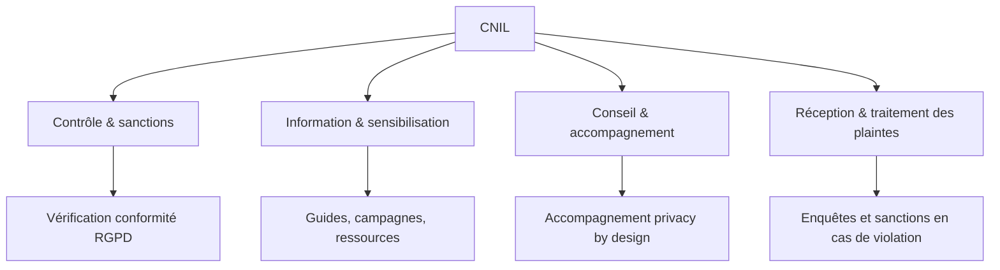

# Article 04-01-01  
## Présentation des missions de la CNIL en matière de protection des données

### Introduction  
La **CNIL** (Commission Nationale de l’Informatique et des Libertés) est l’autorité française indépendante chargée de veiller à la protection des données personnelles. Depuis l'entrée en vigueur du RGPD (Règlement Général sur la Protection des Données) en mai 2018, ses missions ont été renforcées pour garantir le respect des droits fondamentaux des citoyens dans le contexte numérique.

---

### 1. Rôle et missions principales de la CNIL  

#### 1.1 Contrôle et surveillance du respect du RGPD  
La CNIL supervise la conformité des traitements de données personnelles réalisés par les organisations publiques ou privées, à toutes étapes : collecte, stockage, partage, suppression. Elle peut effectuer des contrôles sur place ou en ligne et sanctionner en cas de manquements.  

#### 1.2 Information et sensibilisation  
Elle informe les citoyens et les professionnels sur leurs droits, les obligations légales et les bonnes pratiques pour protéger les données. Elle publie des guides, des outils pédagogiques et organise des campagnes de sensibilisation.  

#### 1.3 Accompagnement et conseil  
La CNIL conseille les responsables de traitement dans la mise en œuvre du RGPD, notamment via l’analyse d’impact relative à la protection des données (AIPD). Elle met à disposition des ressources pour aider à intégrer la protection des données dès la conception (*privacy by design*).  

#### 1.4 Réception et traitement des plaintes  
Elle recueille les plaintes des personnes concernées relatives à la violation de leurs droits et peut lancer des enquêtes afin de faire cesser les pratiques non conformes.  

---

### 2. Exemple d’action de la CNIL  

En 2023, la CNIL a infligé une amende de plusieurs millions d’euros à une grande entreprise de la tech pour insuffisance dans la gestion des consentements au niveau des cookies, illustrant sa vigilance sur la transparence et le consentement éclairé.  

---

### 3. Diagramme Mermaid – Missions de la CNIL  

---

### 4. Implications pratiques  

Pour toute organisation :  
- Mener une cartographie des traitements de données.  
- Mettre en place un registre des activités de traitement.  
- Respecter les droits des personnes (accès, rectification, effacement).  
- Documenter le consentement et être transparent.  
- Réaliser des analyses d’impact pour les traitements à risque.  

---

### Sources  

- [Site officiel CNIL – Qui sommes-nous ?](https://www.cnil.fr/fr/la-cnil)  
- [RGPD – Le texte complet – EUR-Lex](https://eur-lex.europa.eu/legal-content/FR/TXT/?uri=CELEX%3A32016R0679)  
- [CNIL – Sanctions et contrôle](https://www.cnil.fr/fr/la-cnil-peut-elle-sanctionner)  
- [CNIL – Privacy by Design](https://www.cnil.fr/fr/la-protection-des-donnees-des-leconception-confier-le-privacy-design)  
- [Commission Européenne – Guide pratique RGPD](https://ec.europa.eu/info/law/law-topic/data-protection_en)  

---

La CNIL constitue un acteur central dans la protection des données personnelles, conciliant surveillance rigoureuse et accompagnement pédagogique, afin de garantir le respect de la législation dans un monde numérique en mutation rapide.