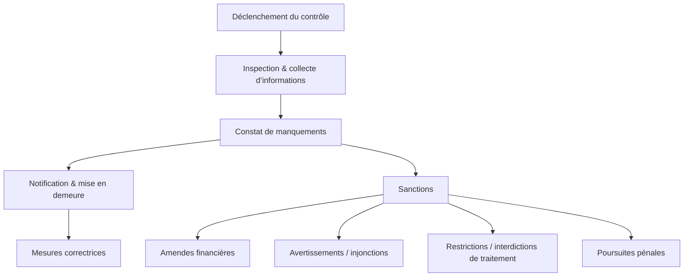

# Article 04-01-02  
## Le rôle de la CNIL dans le contrôle et la sanction des infractions  

### Introduction  
La CNIL exerce un rôle fondamental dans l’application du RGPD en France. Son pouvoir de contrôle et de sanction permet d’assurer le respect des règles protectrices des données personnelles. Cet article détaille les missions de contrôle de la CNIL, la procédure de sanction, et donne des exemples concrets illustrant son action.

---

### 1. Pouvoirs de contrôle de la CNIL  

- **Contrôles programmés ou initiés** : La CNIL réalise des contrôles sur site, en ligne, ou sur pièces, pouvant être annoncés ou inopinés.  
- **Moyens d’investigation** : Elle peut demander toutes informations, consulter des documents, interroger des responsables de traitement, accéder aux systèmes.  
- **Cadre légal** : Ces pouvoirs reposent sur le RGPD (Articles 57 et 58) et la loi Informatique et Libertés.  

---

### 2. Types de manquements sanctionnés  

- Absence de base légale pour le traitement des données (ex : absence de consentement valide).  
- Défaut d’information des personnes concernées ou manque de transparence.  
- Non-respect des droits des utilisateurs (accès, suppression, portabilité).  
- Insuffisance dans la sécurité des données entraînant des fuites ou violations.  
- Défaut de nomination d’un délégué à la protection des données (DPO) lorsque obligatoire.  

---

### 3. Procédure de sanction  

- **Notification de l’infraction** : La CNIL alerte l’organisme et peut ordonner des mesures correctrices.  
- **Mise en demeure** : Un délai est donné pour se conformer.  
- **Sanctions pécuniaires** : Les amendes peuvent atteindre jusqu’à 20 millions d’euros ou 4 % du chiffre d’affaires annuel mondial.  
- **Autres sanctions** : Avertissements, injonctions, limitations temporaires ou définitives du traitement, publications de la sanction, voire poursuites pénales.  

---

### 4. Exemple d’action récente  

En 2022, la CNIL a infligé une amende record de 60 millions d’euros à Google LLC, pour manquements aux règles de transparence et d’information en matière de publicité ciblée, confirmant l’intensification du contrôle européen.  

---

### 5. Diagramme Mermaid – Processus de contrôle et sanction CNIL  

---

### 6. Conséquences pratiques pour les organisations  

- Mettre en place une gouvernance rigoureuse des données (DPO, registre des traitements).  
- Assurer la conformité continue par audits internes.  
- Documenter clairement transparence et consentement.  
- Réagir rapidement aux mises en demeure pour éviter sanctions lourdes.  

---

### Sources  

- [CNIL – Contrôles et sanctions](https://www.cnil.fr/fr/la-cnil-peut-elle-sanctionner)  
- [RGPD Articles 57 & 58 (Pouvoir d’enquête et mesures correctrices)](https://eur-lex.europa.eu/legal-content/FR/TXT/?uri=CELEX%3A32016R0679)  
- [Amende Google 2022 - CNIL communiqué](https://www.cnil.fr/fr/amende-de-60-millions-deuros-contre-google)  
- [CNIL – Procédure de sanction](https://www.cnil.fr/fr/la-procedure-de-sanction)  
- [European Data Protection Board - Enforcement](https://edpb.europa.eu/our-work-tools/enforcement_en)  

---

La CNIL joue un rôle clé pour assurer le respect du RGPD en combinant inspection rigoureuse, dialogue avec les organisations et sanctions adaptées, garantissant ainsi une meilleure protection des données personnelles en France.