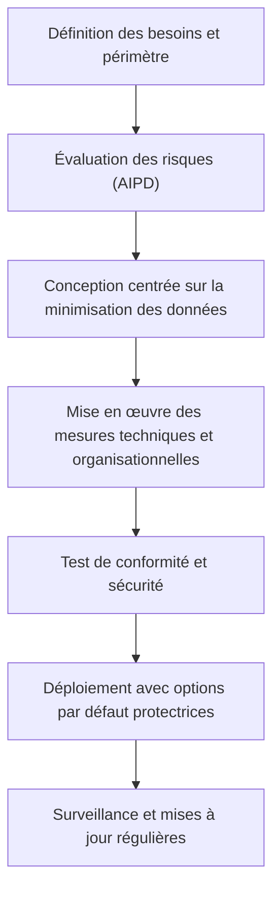

# Article 04-02-01  
## Conception de solutions respectueuses de la vie privée dès la phase de développement

### Introduction  
Le concept de **Privacy-by-Design** (PbD) invite à intégrer la protection des données personnelles dès la conception des systèmes et services numériques, et non en réaction à des problèmes ou après coup. Cette approche préventive, inscrite dans le RGPD, vise à minimiser les risques liés à la vie privée tout au long du cycle de développement.

---

### 1. Principes fondamentaux du Privacy-by-Design  

Selon Ann Cavoukian, pionnière du concept, les 7 principes majeurs du PbD sont :  

1. **Proactive, pas réactif** : anticiper et prévenir les risques de violation de la vie privée.  
2. **Paramètres par défaut protecteurs** : la configuration la plus stricte doit s’appliquer automatiquement.  
3. **Protection intégrée dans la conception** : la vie privée est un élément fondamental, pas un ajout optionnel.  
4. **Fonctionnalité complète (équilibre)** : respecter à la fois la vie privée et les objectifs fonctionnels.  
5. **Sécurité de bout en bout** : assurer la protection continue des données, y compris après leur usage.  
6. **Visibilité et transparence** : rendre les pratiques compréhensibles et vérifiables.  
7. **Respect de la vie privée des utilisateurs** : centrage sur les besoins des personnes et maîtrise des données.  

---

### 2. Intégration pratique du Privacy-by-Design dans le développement  

#### 2.1 Analyse d’impact relative à la protection des données (AIPD)  
Évaluer dès le début les risques liés au traitement des données, identifier les mesures de réduction adaptées et documenter ce processus.  

#### 2.2 Minimisation des données collectées  
Limiter la collecte au strict nécessaire pour le service proposé, réduire la conservation et anonymiser si possible.  

#### 2.3 Contrôles d'accès et chiffrement  
Mettre en œuvre des accès restreints, authentification forte, chiffrement des données en transit et au repos afin de garantir la sécurité.  

#### 2.4 Conception d’interfaces transparentes  
Informer clairement les utilisateurs sur la collecte, l’usage et leurs droits, et faciliter l’exercice de ces droits via des interfaces intuitives.  

#### 2.5 Tests de conformité réguliers  
Tester les fonctionnalités de protection, la résistance aux attaques, et ajuster en fonction des résultats.  

---

### 3. Exemple concret  

Une application mobile de santé intègre dès la conception :  

- Collecte uniquement des données essentielles (ex : fréquence cardiaque).  
- Chiffrement local des données sensibles avant synchronisation.  
- Interface simple permettant à l’utilisateur de révoquer son consentement à tout moment.  
- Rapport d’AIPD démontrant la conformité au RGPD.  

---

### 4. Diagramme Mermaid – Cycle d’implémentation Privacy-by-Design  

---

### 5. Sources  

- [CNIL - Le Privacy-by-Design](https://www.cnil.fr/fr/introduction-au-concept-de-privacy-design)  
- [Règlement Général sur la Protection des Données (RGPD) - Article 25](https://eur-lex.europa.eu/legal-content/FR/TXT/?uri=CELEX%3A32016R0679#d1e2034-1-1)  
- [Information Commissioner’s Office (ICO) - Privacy by Design](https://ico.org.uk/for-organisations/guide-to-data-protection/guide-to-the-general-data-protection-regulation-gdpr/accountability-and-governance/privacy-by-design/)  
- [Ann Cavoukian - 7 Foundational Principles](https://privacybydesign.ca/the-7-foundational-principles/)  
- [OWASP - Privacy by Design Principles](https://owasp.org/www-project-proactive-controls/v3/en/c11-ensure-privacy)  

---

L’approche Privacy-by-Design transforme le développement en une démarche responsable où la protection de la vie privée est intégrée comme un élément clé, assurant aux utilisateurs et aux régulateurs que leurs données sont traitées avec le plus grand soin dès le départ.
