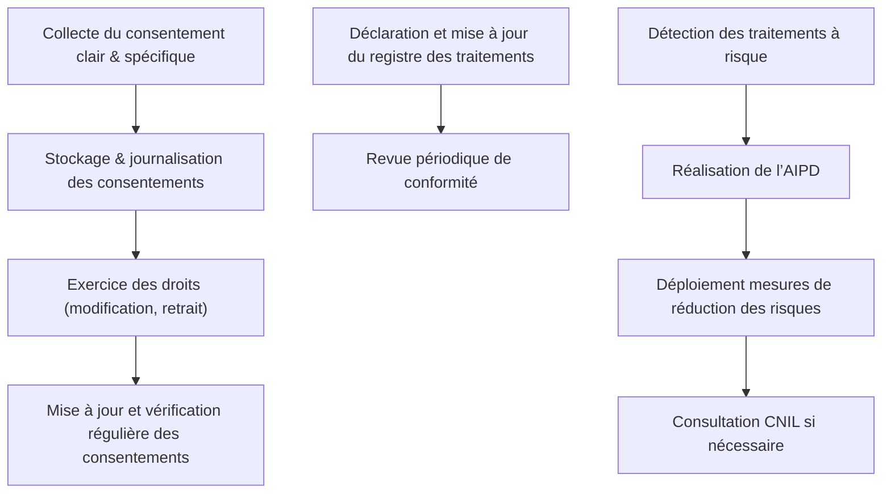

# Article 04-02-02  
## Gestion du consentement et documentation obligatoire (registre, analyse d'impact)

### Introduction  
La gestion du consentement et la tenue d’une documentation rigoureuse sont des exigences centrales du RGPD. Elles assurent la transparence des traitements de données personnelles et renforcent la responsabilité des organisations. Cet article explore comment gérer efficacement le consentement et documenter les traitements par le registre et l’analyse d’impact.

---

### 1. Gestion du consentement selon le RGPD  

#### 1.1 Conditions d’un consentement valide  
- **Libre** : sans pression ni contrainte.  
- **Éclairé** : information claire sur l’usage des données.  
- **Spécifique** : consentement donné pour des finalités précises.  
- **Univoque** : acte positif clair (pas de cases pré-cochées).  
- **Révocable** : possibilité de retirer le consentement à tout moment facilement.  

#### 1.2 Outils et pratiques pour gérer le consentement  
- **Bannière cookies conforme** avec choix granulaire des finalités.  
- **Formulaires de collecte** où chaque finalité est explicitement listée.  
- **Historique ou journal des consentements** pour prouver la conformité en cas de contrôle.  
- **Interface utilisateur claire** pour consulter, modifier ou retirer ses choix.  

---

### 2. Documentation obligatoire  

#### 2.1 Registre des activités de traitement (art. 30 RGPD)  
Toute organisation avec plus de 250 employés, ou dont le traitement présente un risque pour les droits, doit :  
- Inventorier chaque traitement (finalité, données, durées, destinataires).  
- Documenter les mesures de sécurité et la base légale utilisée.  
- Tenir ce registre à jour et le présenter aux autorités en cas de contrôle.  

#### 2.2 Analyse d'impact relative à la protection des données (AIPD) (art. 35 RGPD)  
Nécessaire avant certains traitements à haut risque (ex : données sensibles, surveillance systématique) :  
- Évaluer les impacts sur la vie privée.  
- Identifier et appliquer des mesures de réduction des risques.  
- Consulter la CNIL en cas de risques non maîtrisés.  

---

### 3. Exemples pratiques  

- Un site e-commerce utilise un CMP (Consent Management Platform) permettant aux utilisateurs de choisir précisément quels cookies ils acceptent, avec un journal horodaté des consentements.  
- Une collectivité locale élabore une AIPD avant de déployer un système de vidéosurveillance doté de reconnaissance faciale afin d’atténuer les risques juridiques et techniques.  

---

### 4. Diagramme Mermaid – Cycle de gestion du consentement et documentation  

---

### 5. Sources et outils  

- [CNIL – Guide sur la gestion du consentement](https://www.cnil.fr/fr/cookies-les-outils-pour-les-maitriser)  
- [RGPD – Articles 30 et 35](https://eur-lex.europa.eu/legal-content/FR/TXT/?uri=CELEX%3A32016R0679)  
- [European Data Protection Board – Guidelines on Consent](https://edpb.europa.eu/our-work-tools/our-documents/guidelines/guidelines-072020-consent_en)  
- [IAPP – Privacy Compliance & Impact Assessment](https://iapp.org/resources/article/a-practical-guide-to-dpia/)  
- [Cookiebot](https://www.cookiebot.com) et autres CMP pour la gestion automatisée du consentement  

---

Le respect rigoureux des principes de gestion du consentement et la tenue d’une documentation complète (registre, AIPD) constituent la base d’une gouvernance efficace des données personnelles, garantissant transparence, traçabilité et maîtrise des risques.
