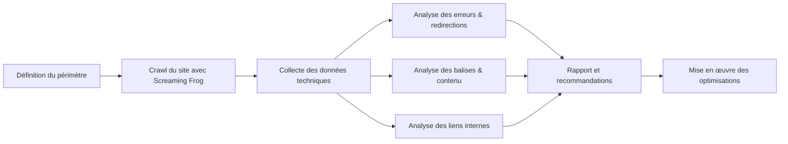

# Article 05-01-01  
## Screaming Frog pour analyse technique complète

### Introduction  
Screaming Frog SEO Spider est un outil incontournable pour l'audit technique SEO. Il permet d’explorer un site web en profondeur, d’identifier les problèmes techniques, et d’analyser la structure des pages web à la manière d’un moteur de recherche. Cet article détaille ses fonctionnalités principales, usages typiques et fournit des exemples concrets.

---

### 1. Qu’est-ce que Screaming Frog ?  

Screaming Frog SEO Spider est un logiciel de crawling qui explore un site comme Googlebot, collectant des données techniques essentielles à la santé SEO : balises meta, contenus dupliqués, erreurs HTTP, performances, etc. Compatible Windows, MacOS et Linux, il dispose d’une version gratuite limitée à 500 URLs et d’une version payante avec fonctionnalités avancées.  

---

### 2. Fonctionnalités clés  

#### 2.1 Analyse des balises HTML  
- Vérification des balises titres (title) et méta descriptions : présence, longueur, duplications.  
- Analyse des balises Hn (H1, H2...) pour la structure sémantique.  

#### 2.2 Détection des erreurs et redirections  
- Identification des erreurs 4xx, 5xx.  
- Cartographie des redirections 301, 302, chains et boucles redirectionnelles.  

#### 2.3 Analyse du contenu  
- Détection de contenu dupliqué sur titres, descriptions, pages.  
- Analyse du poids et du type des ressources (images, scripts).  

#### 2.4 Audit des liens internes  
- Analyse de la structure interne via les liens internes : identification des pages orphelines ou profondes.  
- Extraction des données des URLs et paramètres.  

#### 2.5 Intégration et export des données  
- Intégration possible avec Google Analytics et Search Console.  
- Export des rapports au format CSV, Excel, pour exploitation et suivi.  

---

### 3. Exemple d’usage  

En audit d’un site ecommerce de 1500 pages :  
- Le crawl a révélé 200 pages avec titre absent ou dupliqué, augmentant le risque de pénalisation.  
- 50 URLs retournaient une erreur 404, impactant l’expérience utilisateur et le crawl.  
- La structure des liens internes montrait des profondeurs supérieures à 5 clics pour 150 pages, compromettant leur indexation.  
Ces constats ont guidé les priorités d’optimisation SEO technique.  

---

### 4. Diagramme Mermaid – Flux d’un audit SEO avec Screaming Frog  

---

### 5. Conseils pratiques  

- Utiliser la version gratuite pour des sites jusqu’à 500 URLs, et la version payante pour des audits étendus.  
- Paramétrer les user agents et les délais pour simuler le crawl des moteurs et éviter les blocages.  
- Associer Screaming Frog à Google Analytics pour recouper trafic et données techniques.  
- Réaliser des audits réguliers pour surveiller la qualité technique du site.  

---

### Sources  

- [Screaming Frog Official Website](https://www.screamingfrog.co.uk/seo-spider/)  
- [Moz – How to Use Screaming Frog](https://moz.com/learn/seo/seo-spider)  
- [Search Engine Journal – Screaming Frog Guide](https://www.searchenginejournal.com/how-to-use-screaming-frog-seo-spider/325721/)  
- [Ahrefs – Screaming Frog Tutorial](https://ahrefs.com/blog/screaming-frog/)  

---

Screaming Frog offre un diagnostic technique complet puissant, structuré et exploitable, facilitant la détection rapide des freins SEO pour améliorer la visibilité et la performance des sites web.