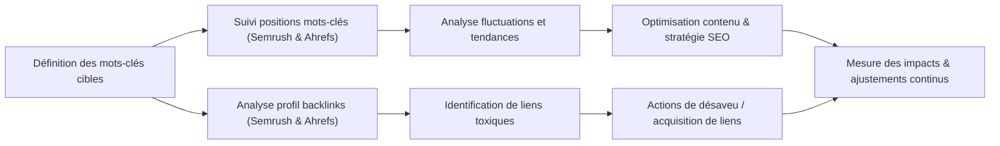

# Article 05-01-02  
## Semrush et Ahrefs pour le suivi des mots-clés et l’analyse de backlinks

### Introduction  
Semrush et Ahrefs sont deux des outils les plus puissants et utilisés en SEO pour le suivi des performances des mots-clés et l’analyse des backlinks. Leur complémentarité permet aux professionnels du référencement d’affiner leur stratégie en explorant à la fois la visibilité organique et le profil de liens externes. Cet article présente leurs fonctionnalités clés, des exemples concrets d’utilisation, ainsi qu’un schéma global de leur workflow.

---

### 1. Suivi des mots-clés  

#### 1.1 Semrush  
- Permet de suivre la position d’un grand nombre de mots-clés dans les SERP (pages de résultats).  
- Offre des rapports d’évolution quotidienne ou hebdomadaire du positionnement.  
- Fournit une analyse concurrentielle détaillée : quels mots-clés génèrent du trafic chez les rivaux.  
- Intègre la fonctionnalité "Position Tracking" avec alertes automatisées en cas de variation significative.  

#### 1.2 Ahrefs  
- Outil de suivi précis avec données historiques des positions des mots-clés.  
- Classement par emplacement géographique, langue, et appareil (mobile/desktop).  
- Exploration des mots-clés nouveaux, perdus, ou gagnés.  
- Indique le volume de recherche, la difficulté, et les clics estimés par mot-clé.  

---

### 2. Analyse des backlinks  

#### 2.1 Semrush  
- Base de données backlink actualisée régulièrement, avec millions de nouveaux liens détectés chaque jour.  
- Analyse des domaines référents, des ancres de lien, et de la qualité des backlinks via des scores.  
- Visualisation des liens toxiques susceptibles de pénaliser le site et rapports pour la désaveu.  
- Surveillance des nouveaux liens obtenus et des perdus.  

#### 2.2 Ahrefs  
- Une des plus grandes bases de données de backlinks au monde.  
- Analyse approfondie des ancres, pages de destination, et types de liens (dofollow/nofollow).  
- Outils pour comparer profils de backlinks entre plusieurs concurrents.  
- Rapport complet sur la « santé » du profil backlink, avec détection des liens spammy.  

---

### 3. Exemple concret d’utilisation  

Une agence SEO suit le positionnement de 200 mots-clés pour un site e-commerce avec Semrush. La surveillance des fluctuations sur 3 marchés (France, Allemagne, Espagne) permet d’ajuster les optimisations. En parallèle, Ahrefs est utilisé pour analyser le profil backlink. L’analyse révèle une augmentation significative des backlinks de sites d’autorité dans la niche, confirmant le succès des actions de netlinking. Une alerte sur Semrush signale une baisse de positions sur certains mots-clés liés à une pénalité algorithmique détectée par Ahrefs (liens toxiques), ce qui déclenche une stratégie de désaveu rapide.  

---

### 4. Diagramme Mermaid – Workflow SEO avec Semrush & Ahrefs  

---

### 5. Conseils d’utilisation  

- Compléter le suivi général par les deux outils pour croiser les données et combler certaines limites (ex : couverture régionale, fréquence de mise à jour).  
- Paramétrer des alertes sur les variations clés pour agir rapidement.  
- Utiliser les scores d’autorité et toxicité pour prioriser les actions liées aux backlinks.  
- Intégrer ces outils dans un tableau de bord SEO global pour un pilotage centralisé.  

---

### Sources  

- [Semrush Official](https://www.semrush.com/)  
- [Ahrefs Official](https://ahrefs.com/)  
- [Backlinko – Semrush vs Ahrefs: Which SEO Tool is Better?](https://backlinko.com/semrush-vs-ahrefs)  
- [Search Engine Journal – How to Use Semrush for SEO](https://www.searchenginejournal.com/semrush-seo-tool/391540/)  
- [Ahrefs Blog – How to Use Ahrefs’ Rank Tracker](https://ahrefs.com/blog/rank-tracker/)  

---

Semrush et Ahrefs répondent chacun à des besoins complémentaires en SEO. Leur exploitation parallèle permet un suivi précis des performances de mots-clés et une gestion proactive du profil backlink, bases essentielles pour optimiser durablement la visibilité d’un site web.
