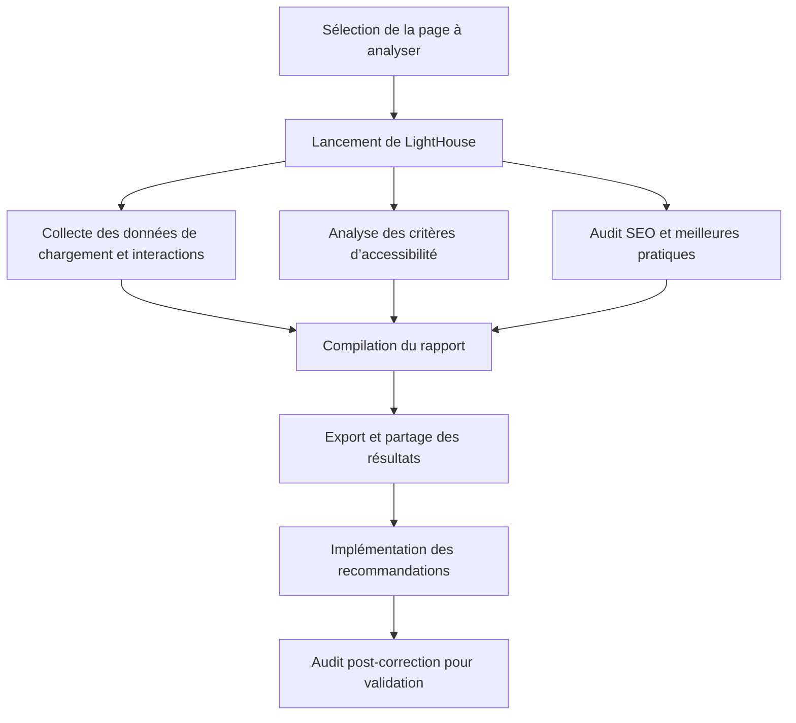

# Article 05-01-03  
## LightHouse pour l’audit performance, accessibilité et SEO

### Introduction  
LightHouse est un outil open source développé par Google qui permet d’auditer les pages web selon plusieurs axes essentiels : performance, accessibilité, meilleures pratiques, SEO et Progressive Web App (PWA). Il fournit des recommandations concrètes pour améliorer l’expérience utilisateur et la visibilité des sites. Cet article détaille les fonctionnalités clés de LightHouse, son utilisation et des cas pratiques.

---

### 1. Présentation de LightHouse  

- Intégré dans Chrome DevTools, disponible en ligne ou via une interface en CLI (ligne de commande).  
- Génère un rapport complet avec scores et diagnostics dans plusieurs catégories :  
  - **Performance** : vitesse de chargement, interactivité, stabilité visuelle (Core Web Vitals).  
  - **Accessibilité (A11y)** : respect des normes d’accessibilité, ergonomie pour tous les utilisateurs.  
  - **Best Practices** : sécurité HTTPS, utilisation correcte des API web, absence d’erreurs JavaScript.  
  - **SEO** : données structurées, balises meta, crawlabilité.  
  - **Progressive Web App (PWA)** : fonctionnement offline, installabilité, notifications.  

---

### 2. Fonctionnalités principales  

#### 2.1 Performance  
Analyse des temps de chargement, First Contentful Paint, Largest Contentful Paint, Time to Interactive, Cumulative Layout Shift. Propose des solutions comme la compression d’images, le lazy loading, la réduction du JavaScript.  

#### 2.2 Accessibilité  
Détecte les erreurs standards comme le contraste insuffisant, l’absence d’attributs alt sur les images, la navigation au clavier non fonctionnelle, ou les roles ARIA manquants.  

#### 2.3 SEO  
Vérifie la présence des balises title, meta description, hreflang, robots.txt, sitemap.xml, et la lisibilité mobile.  

#### 2.4 Rapports détaillés  
Export des rapports en HTML ou JSON, avec recommandations précises classées par priorité.  

---

### 3. Exemple d’audit LightHouse  

Pour une page d’accueil d’un portail d’actualité :  
- Score performance : 76/100, améliorations recommandées sur la mise en cache et l’optimisation des polices.  
- Score accessibilité : 90/100, signalant un faible contraste sur certains boutons et des labels manquants.  
- Score SEO : 85/100, avec mention de l’absence de balises hreflang pour la gestion multilingue.  
Ce diagnostic aide l’équipe technique à prioriser les correctifs pour améliorer la qualité globale.  

---

### 4. Diagramme Mermaid – Processus d’audit avec LightHouse  

---

### 5. Conseils d’utilisation  

- Utiliser LightHouse régulièrement lors du développement et avant mise en production.  
- Prioriser les Core Web Vitals qui impactent la UX et le référencement naturel.  
- Coupler avec d’autres outils (ex : Screaming Frog, Semrush) pour un audit global.  
- Intégrer LightHouse dans les pipelines CI/CD pour garantir la qualité continue.  

---

### Sources  

- [LightHouse - Documentation officielle Google](https://developers.google.com/web/tools/lighthouse)  
- [Chrome DevTools - Utiliser LightHouse](https://developer.chrome.com/docs/devtools/lighthouse/)  
- [Google Web Fundamentals - Core Web Vitals](https://web.dev/vitals/)  
- [MDN Web Docs - Accessibilité Web](https://developer.mozilla.org/fr/docs/Web/Accessibility)  
- [Smashing Magazine - Guide d’utilisation de LightHouse](https://www.smashingmagazine.com/2020/10/how-to-use-lighthouse-web-performance-tool/)  

---

LightHouse offre un diagnostic complet et accessible, combinant performance, accessibilité et SEO. Sa prise en main rapide et ses rapports détaillés en font un outil précieux pour améliorer la qualité des sites web et augmenter leur visibilité.