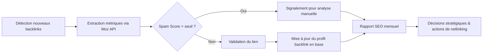

# Article 05-01-04  
## Moz pour les métriques SEO avancées et API

### Introduction  
Moz est une plateforme SEO reconnue pour ses métriques avancées qui permettent d’évaluer la qualité et l’autorité des sites web ainsi que pour ses APIs puissantes, facilitant l’intégration des données SEO dans des outils personnalisés ou des processus automatisés. Cet article présente les fonctionnalités principales de Moz, ses métriques clés, ainsi que ses possibilités via API, avec des exemples concrets d’application.

---

### 1. Les métriques avancées de Moz  

#### 1.1 Domain Authority (DA)  
Indicateur de la force globale d’un domaine sur une échelle de 1 à 100, basé sur plusieurs facteurs dont le profil backlink. Plus le DA est élevé, plus le site a de chances de bien se positionner dans les moteurs de recherche.  

#### 1.2 Page Authority (PA)  
Mesure spécifiquement la force d’une page individuelle, utilisant une méthodologie similaire au DA. Utile pour identifier les pages clés à optimiser ou à renforcer via du netlinking.  

#### 1.3 Spam Score  
Indique la probabilité qu’un domaine ait un profil de liens ou une architecture potentiellement toxique, basée sur des signaux négatifs. Permet d’évaluer rapidement les risques SEO liés aux backlinks.  

---

### 2. APIs Moz  

Moz propose plusieurs APIs qui facilitent l’accès et l’intégration des données dans des workflows personnalisés :  

- **Link Explorer API** : extraction des données de backlink, DA, PA, Spam Score.  
- **Keyword Explorer API** : données sur les volumes de recherche, difficulté, opportunités des mots-clés.  
- **URL Metrics API** : métriques détaillées pour une URL donnée.  

Cette ouverture permet, par exemple, d’automatiser le suivi SEO, d’intégrer des données avancées dans un tableau de bord entreprise ou de valider des décisions stratégiques basées sur des indicateurs fiables.  

---

### 3. Exemple d’usage  

Une équipe SEO utilise Moz API pour automatiser le contrôle mensuel des nouveaux backlinks. Chaque lien est analysé en temps réel : si le Spam Score dépasse 5%, le lien est automatiquement signalé à l’équipe pour vérification, ce qui optimise la réactivité face à une possible pénalité. Par ailleurs, l’équipe utilise le DA et le PA pour prioriser les efforts d’acquisition de liens en ciblant des sites à forte autorité.  

---

### 4. Diagramme Mermaid – Workflow intégrant Moz API pour la gestion des backlinks  

---

### 5. Conseils pratiques  

- Utiliser les métriques DA et PA comme indicateurs relatifs, en les comparant aux concurrents du même secteur.  
- Ne pas se fier exclusivement au Spam Score ; croiser avec d’autres outils pour confirmer un profil toxique.  
- Prioriser l’intégration des API pour automatiser les tâches répétitives et réduire les délais de réaction.  
- Mettre en place des alertes automatiques pour les variations importantes de métriques.  

---

### Sources  

- [Moz – Metrics Overview](https://moz.com/learn/seo/domain-authority)  
- [Moz API Documentation](https://moz.com/products/api)  
- [Search Engine Journal – Moz Metrics Explained](https://www.searchenginejournal.com/moz-metrics/324211/)  
- [Ahrefs – Moz vs Ahrefs Comparison](https://ahrefs.com/blog/moz/)  

---

Moz offre un ensemble unique de métriques avancées et d’API robustes, permettant d’enrichir l’analyse SEO tout en automatisant le suivi et la gestion des backlinks, éléments clefs d’une stratégie SEO performante et agile.