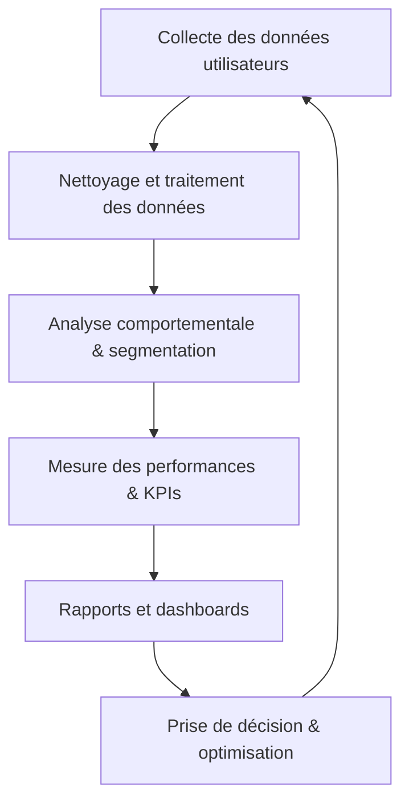

# Article 06-01-01  
## Définition et objectifs de la web analyse

### Introduction  
La web analyse est une discipline qui consiste à collecter, mesurer, analyser et rapporter les données provenant d’un site web ou d’une application mobile afin d’améliorer la performance numérique, l’expérience utilisateur et la prise de décision marketing. Cet article définit précisément la web analyse, ses objectifs opérationnels, et illustre son processus global par un schéma.

---

### 1. Qu’est-ce que la web analyse ?  

La web analyse est un ensemble de méthodes et outils destinés à :  
- **Collecter les données quantitatives et qualitatives** liées au comportement des visiteurs (pages vues, taux de rebond, temps passé).  
- **Analyser ces données** pour comprendre comment les utilisateurs interagissent avec un site.  
- **Mesurer la performance** des actions digitales (campagnes marketing, parcours utilisateur).  
- **Optimiser l’expérience utilisateur et les conversions** en prenant des décisions éclairées basées sur des faits.  

Il s’agit d’une discipline clé dans le digital qui transforme des données brutes en indicateurs exploitables.  

---

### 2. Objectifs principaux  

#### 2.1 Comprendre le comportement des internautes  
Évaluer les parcours, points d’entrée et de sortie, zones chaudes (click maps), et identifier les freins ou sources d’abandon.  

#### 2.2 Mesurer la performance des campagnes marketing  
Analyser le trafic généré par différentes sources (SEO, SEA, réseaux sociaux, emailings) pour optimiser le budget et le ciblage.  

#### 2.3 Suivre les indicateurs de conversion  
Taux de conversion, valeur moyenne des commandes, taux d’abandon de panier, etc., pour maximiser le retour sur investissement (ROI).  

#### 2.4 Améliorer l’expérience utilisateur  
Identifier les pages à problèmes, rendre le site plus fluide, rapide et accessible.  

#### 2.5 Piloter la stratégie digitale  
Fournir des rapports réguliers pour orienter la prise de décision des équipes marketing, commerciales et techniques.  

---

### 3. Exemples concrets  

- **E-commerce** : une analyse web révèle que 40% des visiteurs quittent la page de paiement, entraînant une optimisation du tunnel d’achat et une augmentation des ventes de 15%.  
- **Site média** : la mesure du temps passé sur les articles guide la création de contenus plus engageants et adaptés aux attentes des lecteurs.  
- **Campagne digitale** : une campagne Facebook affichant un taux de clic faible est resserrée sur un segment d’audience plus pertinent après analyse des données.  

---

### 4. Diagramme Mermaid – Processus typique de la web analyse  

---

### 5. Outils populaires  

- **Google Analytics** : leader du marché avec des dizaines de métriques standardisées.  
- **Matomo** (ex-Piwik) : solution open source offrant respect de la vie privée et personnalisation avancée.  
- **Adobe Analytics** : solution professionnelle avec analyses très poussées pour grands comptes.  
- **Hotjar, Crazy Egg** : compléments pour analyser le comportement utilisateur via cartes de chaleur et feedbacks.  

---

### Sources  

- [Google Analytics Academy](https://analytics.google.com/analytics/academy/)  
- [AT Internet - Qu’est-ce que la web analyse ?](https://www.atinternet.com/fr/web-analytics-definition/)  
- [Matomo - Introduction à la web analyse](https://matomo.org/faq/general/what-is-web-analytics/)  
- [ContentSquare - Web Analytics Guide](https://contentsquare.com/resources/web-analytics/)  
- [Neil Patel - What is Web Analytics?](https://neilpatel.com/what-is-web-analytics/)  

---

La web analyse est un levier essentiel pour comprendre et améliorer la performance digitale. Elle permet d’orienter précisément les actions vers des résultats mesurables, en transformant les données utilisateurs en intelligence opérationnelle.