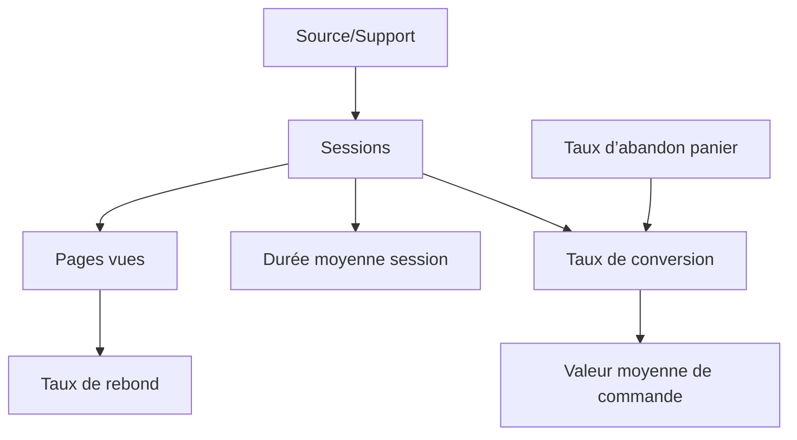

# Article 06-01-02  
## Présentation des principaux KPI et métriques en web analyse

### Introduction  
Pour piloter efficacement les performances d’un site web ou d’une application digitale, il est indispensable de comprendre et maîtriser les indicateurs clés de performance (KPI) et les métriques de la web analyse. Ces outils quantitatifs permettent de mesurer les résultats, identifier les leviers d’amélioration, et orienter les prises de décision. Cet article présente les principaux KPI et métriques, leur signification, et donne des exemples d’application.

---

### 1. Principaux KPI en web analyse  

| KPI                     | Description                                                                 | Objectif principal                      | Exemple d’usage                                                 |
|-------------------------|-----------------------------------------------------------------------------|---------------------------------------|----------------------------------------------------------------|
| **Sessions**            | Nombre de visites distinctes sur une période donnée                         | Mesurer le trafic global               | Analyser la fréquentation avant et après une campagne promotionnelle |
| **Utilisateurs uniques**| Nombre d’individus ayant visité le site                                     | Déterminer la taille de l’audience    | Suivre l’évolution de la base visiteurs sur un site d’info     |
| **Pages vues**           | Nombre total de pages consultées                                            | Évaluer l’engagement                   | Identifier les contenus les plus consultés                      |
| **Taux de rebond**      | % de sessions où l’utilisateur quitte après une seule page                  | Mesurer l’attractivité / pertinence   | Détecter les pages d’entrée peu performantes                    |
| **Durée moyenne session**| Temps moyen passé par session                                              | Estimer l’intérêt des visiteurs       | Mesurer l’impact des améliorations UX                           |
| **Taux de conversion**  | % d’utilisateurs réalisant une action attendue (achat, inscription, etc.)  | Mesurer l’efficacité du site          | Optimiser un tunnel d’achat ou formulaire                        |
| **Valeur moyenne de commande** | Montant moyen dépensé par transaction                                | Suivre la rentabilité                  | Ajuster les stratégies de pricing ou promotions                 |
| **Source/Support**      | Canal d’acquisition du trafic (SEO, SEA, email, social, direct)             | Identifier les leviers marketing      | Réallouer les budgets en fonction de la performance des canaux  |

---

### 2. Métriques complémentaires  

- **Pages par session** : indique l’approfondissement de la visite. Plus ce chiffre est élevé, plus l’utilisateur explore le site.  
- **Taux d’abandon de panier** : dans l’e-commerce, pourcentage d’utilisateurs ayant mis un produit en panier sans finaliser l’achat.  
- **CTR (Click-Through Rate)** : taux de clic sur un élément (annonce, bouton), mesure l’attractivité.  
- **Engagement mobile** : taux de rebond et durée sur mobile, très important compte tenu de la part croissante du trafic mobile.  

---

### 3. Exemple concret d’analyse de KPI  

Un site e-commerce observe :  
- 10 000 sessions mensuelles,  
- Taux de rebond de 55%,  
- Taux de conversion de 2%,  
- Valeur moyenne de commande 65€.  

Après analyse, le taux de rebond élevé sur la page produit principale (70%) indique un problème d’ergonomie. Une refonte améliorant le design et le temps de chargement réduit le taux à 40% et augmente la conversion à 3,2%, générant un accroissement significatif du chiffre d’affaires.  

---

### 4. Diagramme Mermaid – Relations entre KPI  

Ce diagramme illustre comment les différentes métriques interagissent pour fournir une vision intégrée des performances.  

---

### 5. Conseils pour choisir ses KPI  

- Aligner les KPI aux objectifs business (notoriété, conversion, fidélisation).  
- Ne pas saturer le reporting : 5 à 7 KPI clés suffisent souvent.  
- Sélectionner des KPI actionnables permettant de définir des leviers d’amélioration concrets.  
- Adapter les KPI au type de site et à son audience.  

---

### Sources  

- [Google Analytics Help – Important Metrics](https://support.google.com/analytics/answer/3123901?hl=en)  
- [Adobe Analytics Metrics Guide](https://experienceleague.adobe.com/docs/analytics/metrics/dimensions.html)  
- [Neil Patel – Top 7 Important Website Metrics](https://neilpatel.com/blog/website-analytics-metrics/)  
- [Hotjar – The Must-Have Metrics](https://www.hotjar.com/blog/web-analytics-metrics/)  
- [Contentsquare – Web Analytics KPIs](https://contentsquare.com/resources/kpi-analytics-web/)

---

Comprendre et maîtriser les principaux KPI et métriques est une étape fondamentale pour toute démarche d’optimisation digitale. Ils permettent de suivre le comportement des visiteurs, mesurer l’impact des actions marketing et améliorer la rentabilité par une gestion agile et ciblée.