# Article 07-01-01  
## Nouveautés et différences de GA4 par rapport à Universal Analytics

### Introduction  
Google Analytics 4 (GA4) marque une rupture majeure avec l’ancienne version Universal Analytics (UA). Conçu pour s’adapter aux évolutions liées à la protection des données, à l’omnicanalité et aux nouveaux comportements utilisateurs, GA4 propose une architecture et des fonctionnalités repensées. Cet article détaille ces nouveautés-clés et met en lumière les différences avec UA, en s’appuyant sur des exemples concrets et un schéma explicatif.

---

### 1. Modèle de données événementiel contre modèle basé sur les sessions  

- **Universal Analytics** : structure ses données autour des sessions et des pages vues. Une session est un groupe d’interactions sur un site durant une période donnée (en général 30 minutes).  
- **GA4** : utilise un modèle entièrement basé sur les événements. Chaque interaction est un événement, permettant une granularité et une flexibilité bien plus importantes.  

**Exemple :**  
Dans GA4, un scroll, un clic sur un lien, la lecture d’une vidéo, un achat sont tous des événements distincts, sans dépendance aux "sessions". Cela permet une analyse plus fine des parcours utilisateurs, notamment sur mobile ou apps.  

---

### 2. Meilleur suivi cross-platform et utilisateur  

GA4 centralise la collecte de données web et applications dans une même propriété, avec un identifiant unique par utilisateur. Cela facilite :  
- Le suivi multi-appareils (desktop, mobile, tablette).  
- Une meilleure compréhension du comportement global sans duplication.  

---

### 3. Intégration renforcée du machine learning  

GA4 intègre des modèles prédictifs basés sur le Machine Learning, permettant par exemple :  
- Estimer la probabilité d’attrition des clients.  
- Prédire la valeur future d’un utilisateur.  
- Automatiser la détection d’anomalies dans les données.  

Ces fonctionnalités optimisent les segments d’audience et la personnalisation marketing sans besoin d’expertise avancée.  

---

### 4. Nouveaux rapports et interface repensée  

GA4 propose une interface plus flexible avec des rapports personnalisables centrés sur le cycle de vie utilisateur : acquisition, engagement, monétisation, fidélisation. La disparition des rapports prédéfinis rigides se traduit par plus de liberté pour explorer les données.  

---

### 5. Respect de la vie privée et conformité RGPD  

- GA4 adopte une approche plus respectueuse de la vie privée en limitant la collecte de données personnelles et en fonctionnant sans cookies tiers obligatoire.  
- Il permet une meilleure gestion du consentement utilisateur et des options de suppression/portabilité intégrées nativement.  

---

### 6. Exemples d’utilisation concrets  

- **E-commerce** : suivi détaillé de chaque étape du tunnel d’achat via les événements (clics sur produits, ajouts au panier, abandons) pour affiner les campagnes de remarketing.  
- **Application mobile** : analyse unique des interactions dans l'app et sur le site, corrigeant les silos de données entre plateformes.  

---

### 7. Diagramme Mermaid – Comparaison synthétique UA vs GA4  

```mermaid
graph LR
    UA[Universal Analytics] -->|Basé sur| A[Sessions et pages vues]
    GA4[Google Analytics 4] -->|Basé sur| B[Modèle événementiel flexible]
    UA --> C[Rapports prédéfinis et rigides]
    GA4 --> D[Rapports personnalisables - Cycle de vie utilisateur]
    UA --> E[Suivi Web uniquement]
    GA4 --> F[Suivi web + app unifié]
    UA --> G[Collecte cookies tiers obligatoire]
    GA4 --> H[Collecte privacy-centric, sans cookies tiers requis]
    UA --> I[Suivi limité multi-appareil]
    GA4 --> J[Suivi multi-appareil avec ID unique]
    C --> K[Interface rigide]
    D --> K2[Interface flexible]
```

---

### Sources  

- [Google Analytics 4 Official Documentation](https://support.google.com/analytics/answer/10089681)  
- [Google Marketing Platform Blog - What’s New in GA4](https://www.blog.google/products/marketingplatform/analytics/new_google_analytics/)  
- [Simo Ahava - GA4 vs Universal Analytics](https://www.simoahava.com/analytics/ga4-vs-universal-analytics/)  
- [Analytics Mania - GA4 Event Tracking Guide](https://www.analyticsmania.com/post/google-analytics-4-event-tracking/)  
- [Data Studio Insights on GA4](https://datastudio.google.com/reporting/ga4)  

---

Bien que GA4 requière une période d’adaptation, ses nouveautés techniques apportent une richesse analytique et un respect renforcé des données personnelles. Son adoption progressive répond aux enjeux modernes de la mesure digitale sur tous types de plateformes.