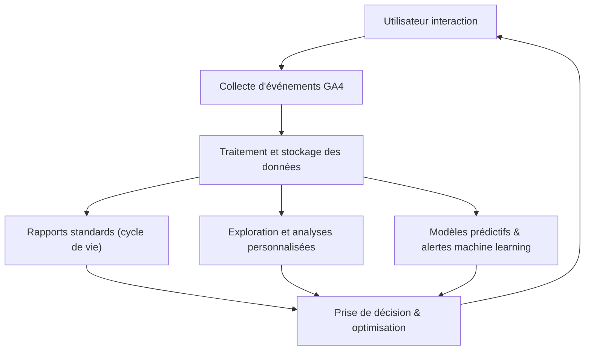

# Article 07-01-02  
## Collecte et analyse des données avec Google Analytics 4 (GA4)

### Introduction  
Google Analytics 4 (GA4) révolutionne la manière dont les données digitales sont collectées et analysées. Cette version mise sur un modèle de collecte événementiel flexible, une meilleure intégration multi-plateforme, et des outils d’analyse enrichis pour comprendre précisément le comportement des utilisateurs. Cet article explore les méthodes de collecte, la structure des données, ainsi que les principales fonctionnalités d’analyse offertes par GA4, accompagnées d’exemples pratiques et d’un diagramme illustratif.

---

### 1. Collecte des données avec GA4  

#### 1.1 Modèle basé sur les événements  
GA4 capture les interactions des utilisateurs sous forme d’événements, sans distinction rigide entre types (comme dans Universal Analytics avec sessions et hits). Voici les trois grandes catégories d’événements :  
- **Événements automatiques** : intégrés par défaut, par exemple page_view, first_visit, scroll, user_engagement.  
- **Événements recommandés** : proposés par Google pour des cas courants (purchase, login, sign_up), à implémenter manuellement.  
- **Événements personnalisés** : adaptés à des besoins spécifiques via le paramétrage dans Google Tag Manager ou dans le code.  

Cette flexibilité permet d’enrichir la collecte sans contraintes préalables lourdes.

#### 1.2 Collecte multi-plateforme  
GA4 unifie la collecte entre site web, applications mobiles, et même appareils IoT, grâce à l’attribution par User-ID. Un même utilisateur est suivi de manière cohérente, facilitant une vue holistique de l’expérience.

#### 1.3 Respect de la vie privée  
Le tracking GA4 est conçu pour s’adapter aux exigences modernes (RGPD, CCPA) :  
- Anonymisation IP par défaut.  
- Possibilité de limiter la collecte des données.  
- Fonctionnalités de gestion du consentement intégrées à la plateforme.  

---

### 2. Analyse des données dans GA4  

#### 2.1 Rapports centrés sur le cycle de vie utilisateur  
GA4 organise ses rapports autour des étapes clés : acquisition, engagement, monétisation et rétention. Chaque phase se décompose en mesures précises facilitant les décisions opérationnelles.  

#### 2.2 Analyse exploratoire avec l’Explorateur (Exploration)  
Outil puissant de reporting personnalisé permettant :  
- Segmentation fine.  
- Visualisation par entonnoirs (funnels), entonnoirs inversés, cohortes.  
- Analyse du chemin utilisateur (path analysis).  

Cette approche proactive permet d’identifier des zones de friction, des opportunités ou des comportements spécifiques.

#### 2.3 Intégration du machine learning  
GA4 assure des insights automatiques grâce à l’intelligence artificielle, comme :  
- Alertes sur anomalies de trafic.  
- Probabilités prédictives de churn ou conversion.  
- Création de segments d’audience « prêts à l’emploi » pour le remarketing.  

---

### 3. Exemple concret  

Une application mobile joue sur la fidélisation client. Avec GA4, l’équipe analyse le funnel d’engagement :  
- Étapes décrochées via Exploration,  
- Identification des écrans où les utilisateurs abandonnent,  
- Mise en place d’une campagne ciblée sur les segments à risque de churn définis par les prédictions GA4.  

Résultat : réduction du taux de désinstallation de 10% sur 3 mois.

---

### 4. Diagramme Mermaid – Cycle de collecte et analyse GA4  

---

### Sources  

- [Google Analytics 4 (GA4) Documentation](https://support.google.com/analytics/answer/10089681)  
- [Google Developers - GA4 Data Model](https://developers.google.com/analytics/devguides/collection/ga4/events)  
- [Simo Ahava - GA4 Event Tracking](https://www.simoahava.com/analytics/google-analytics-4-event-tracking-guide/)  
- [Search Engine Journal - GA4 Data Collection Explained](https://www.searchenginejournal.com/google-analytics-4-data-collection/418966/)  
- [Google Marketing Platform Blog - Machine Learning in GA4](https://www.blog.google/products/marketingplatform/analytics/introducing-machine-learning-insights-ga4/)  

---

GA4 offre un cadre moderne pour la collecte et l’analyse des données, adaptable à tous types de plateformes et respectueux des règlements actuels. Sa puissance analytique combinée à son modèle basé sur les événements invite à une compréhension plus riche et dynamique des parcours utilisateurs, indispensable pour optimiser les performances digitales.
