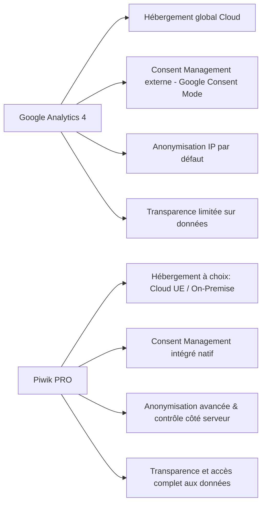

# Article 07-02-02  
## Comparaison entre Piwik PRO et GA4 en termes de respect de la vie privée

### Introduction  
Dans un contexte réglementaire exigeant comme celui du RGPD et des lois équivalentes dans le monde, la collecte et l’analyse des données web doivent être conformes aux impératifs de protection de la vie privée. Google Analytics 4 (GA4) et Piwik PRO sont deux solutions d’analyse digitale qui adoptent des approches différentes en matière de gestion de la vie privée. Cet article compare ces deux plateformes sur leurs fonctionnalités liées à la confidentialité, en s’appuyant sur des éléments concrets.

---

### 1. Gouvernance des données et hébergement  

| Critère               | GA4                                        | Piwik PRO                                   |
|-----------------------|--------------------------------------------|---------------------------------------------|
| **Hébergement des données** | Cloud mondial chez Google, données stockées principalement aux États-Unis mais souvent réparties géographiquement | Choix entre Cloud européen (hébergement en UE) ou On-Premise (sur serveurs propres) |
| **Contrôle des données**       | Contrôle limité, dépend des engagements Google         | Contrôle total pour l’utilisateur final, accès direct aux données brutes          |
| **Souveraineté des données**   | Limité, compliquant la conformité selon plusieurs juridictions | Fort, adapté aux exigences locales comme RGPD et autres réglementations nationales  |

---

### 2. Collecte et anonymisation des données  

- **GA4** :  
  - Anonymisation IP activée par défaut.  
  - Collecte d’identifiants utilisateur et cookies dans le cadre du consentement.  
  - Utilisation croissante du machine learning pour combler les manques liés à la limitation des cookies.  

- **Piwik PRO** :  
  - Options avancées d'anonymisation (masquage IP, anonymisation des utilisateurs).  
  - Consent Manager intégré pour la gestion fine et centralisée du consentement.  
  - Possibilité d’exclure la collecte des données personnelles directement au niveau du serveur.  

---

### 3. Gestion du consentement  

- **GA4** : s’appuie sur des solutions tierces ou Google Consent Mode pour gérer le consentement utilisateur, imposant parfois une intégration externe.  
- **Piwik PRO** : intègre nativement un Consent Manager conforme RGPD, ePrivacy, CCPA, offrant une granularité des préférences cookies et la capacité d’adapter la collecte selon les choix exprimés.

---

### 4. Transparence et conformité  

- **GA4** : la gestion des données se fait via les conditions contractuelles Google, avec des points d’accès limités pour l’utilisateur. Certaines zones d’ombre peuvent subsister sur l’utilisation des données en dehors du périmètre défini.  
- **Piwik PRO** : garantit une transparence complète avec des audits, un accès aux données en temps réel, un contrôle total des tiers éventuels, et un historique complet des consentements et traitements effectués.  

---

### 5. Exemple concret  

Une collectivité territoriale européenne a migré de GA4 vers Piwik PRO afin d’assurer :  
- Le respect strict du RGPD avec hébergement local des données.  
- Une gestion simplifiée et intégrée des consentements.  
- Une meilleure maîtrise de l’accès aux données sensibles, évitant les transferts non contrôlés hors UE.  

---

### 6. Diagramme Mermaid – Comparaison synthétique  

---

### Sources  

- [Piwik PRO Privacy Compliance Documentation](https://piwik.pro/privacy-compliance/)  
- [Google Analytics 4 Privacy & Compliance](https://support.google.com/analytics/answer/9019185)  
- [CNIL - Cookies et traceurs](https://www.cnil.fr/fr/cookies-et-autres-traceurs-le-point-sur-la-reglementation)  
- [Forrester Report - Evaluation of Analytics Platforms](https://go.piwik.pro/forrester-wave-digital-analytics/)  
- [IAPP - Privacy Comparison of Google Analytics and Piwik PRO](https://iapp.org/news/a/comparing-google-analytics-and-piwik-pro-privacy-considerations/)  

---

GA4 et Piwik PRO répondent au défi du respect de la vie privée mais le choix dépend largement du niveau de contrôle souhaité, des contraintes réglementaires spécifiques, et de la stratégie d’hébergement. Piwik PRO offre une plus grande maîtrise des données avec une solution adaptée aux exigences européennes strictes, tandis que GA4 s'appuie sur l’écosystème Cloud Google, offrant une expérience puissante mais moins centrée sur la souveraineté des données.