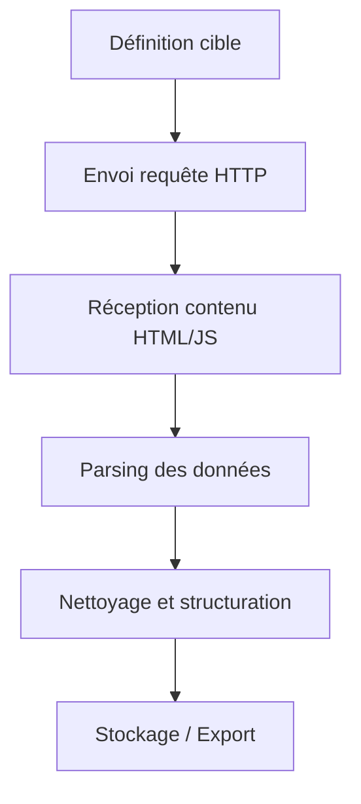

# Article 08-01-01  
## Définition et méthodes de scraping web  

### Introduction  
Le scraping web est une technique d’extraction automatisée de données à partir de sites web. Elle permet de collecter rapidement des informations disponibles publiquement, souvent pour les analyser, les agréger ou les réutiliser. L’exercice du scraping nécessite une compréhension des méthodes utilisées, des enjeux légaux et des impacts techniques. Cet article présente les définitions, principales méthodes de scraping, ainsi que des illustrations concrètes.

---

### 1. Qu’est-ce que le scraping web ?  

Le scraping web désigne le processus automatisé qui consiste à extraire des données structurées à partir de pages web. Ces données peuvent être des textes, images, liens, prix ou tout autre contenu affiché sur un site. Le scraper agit généralement comme un navigateur automatisé simulant la consultation d’une page.  

**Différence avec le crawling :** le crawling consiste à parcourir des pages pour cartographier un site, tandis que le scraping vise à collecter des informations précises.  

---

### 2. Méthodes courantes de scraping  

| Méthode                   | Description                                      | Exemple d’utilisation                       |
|---------------------------|------------------------------------------------|---------------------------------------------|
| **Scraping statique (HTML)** | Récupération du code source HTML et parsing par expressions régulières, XPath ou CSS selectors. | Extraction des prix produits sur un site e-commerce. |
| **Scraping dynamique (JavaScript)** | Exécution du JavaScript sur la page pour obtenir les données générées dynamiquement (via outils tels que Puppeteer, Selenium). | Collecte de commentaires affichés uniquement après interactions utilisateur. |
| **API scraping**           | Utilisation non officielle d’API publiques ou privées pour récupérer les données structurées. | Collecte de données depuis une API de réseau social. |
| **Extraction par OCR**     | Capture des informations contenues dans des images ou PDF affichés sur le site. | Extraction de texte sur des factures ou documents scannés. |

---

### 3. Fonctionnement technique simplifié  

Un scraper fonctionne généralement selon ces étapes :  
1. Envoi d’une requête HTTP vers la page cible.  
2. Récupération du contenu HTML.  
3. Parsing du contenu pour isoler les données d’intérêt via sélecteurs ou expressions régulières.  
4. Stockage des données extraites dans un format exploitable (CSV, JSON, base de données).  

---

### 4. Exemple d’utilisation simple (Python avec BeautifulSoup)  

```python
import requests
from bs4 import BeautifulSoup

url = "https://example.com/products"
response = requests.get(url)
soup = BeautifulSoup(response.content, 'html.parser')

for product in soup.select('.product-item'):
    title = product.select_one('.title').text.strip()
    price = product.select_one('.price').text.strip()
    print(f"Produit: {title} - Prix: {price}")
```

Ce script récupère les noms et prix des produits listés sur la page.

---

### 5. Diagramme Mermaid – Flux de scraping  



---

### 6. Enjeux et limites  

- **Respect des conditions d’utilisation** : certains sites interdisent explicitement le scraping dans leurs CGU.  
- **Impact technique** : surcharge du serveur cible, blocages IP ou captchas.  
- **Problématiques légales** : protection des données personnelles, droit d’auteur.  
- **Fiabilité et maintenance** : modification régulière de la structure des pages peut casser les scripts.  

---

### Sources  

- [ScrapingBee - Guide complet du web scraping](https://www.scrapingbee.com/blog/web-scraping-python/)  
- [Mozilla Developer Network - Introduction to scraping](https://developer.mozilla.org/en-US/docs/Learn/Common_questions/What_is_web_scraping)  
- [Scrapy Documentation](https://docs.scrapy.org/en/latest/intro/overview.html)  
- [Towards Data Science - Web Scraping Techniques](https://towardsdatascience.com/the-absolute-beginners-guide-to-web-scraping-in-python-b9397b53afeb)  
- [Legal aspects of web scraping - Harvard Journal](https://cyber.harvard.edu/publications/2019/01/webscraping)

---

Le scraping web est un outil puissant pour récupérer des données en masse, mais son utilisation requiert rigueur et prudence, notamment au regard des conditions légales et techniques. Connaître les méthodes permet d’adapter sa stratégie à la structure du site cible et à ses besoins précis.