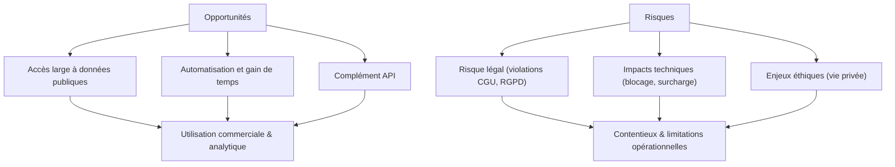

# Article 08-01-02  
## Risques et opportunités liés au scraping web  

### Introduction  
Le scraping web, pratique consistant à extraire automatiquement des données depuis internet, ouvre des perspectives importantes pour la collecte d’informations à grande échelle. Cependant, cette technique comporte également des risques techniques, légaux et éthiques. Cet article analyse les principales opportunités offertes par le scraping ainsi que les risques associés, illustrés par des exemples concrets et accompagné d’un schéma explicatif.

---

### 1. Opportunités du scraping  

#### 1.1 Accès à des données larges et variées  
Le scraping permet de collecter rapidement des données provenant de multiples sources publiques sans dépendre d’API parfois limitées ou inexistantes. Ce processus est couramment utilisé pour :  
- **Veille concurrentielle** (prix, promotions, nouveautés).  
- **Agrégation d’informations** (offres d’emploi, données immobilières, avis clients).  
- **Recherche et analyse scientifique** (collecte de données publiques).  

**Exemple :** une startup agrège automatiquement toutes les annonces immobilières d’une région pour créer une base de données actualisée en temps réel, évitant le recours à chaque portail individuellement.

#### 1.2 Automatisation et gain de temps  
Automatiser la collecte réduit les coûts et erreurs humaines par rapport à une récupération manuelle.

#### 1.3 Complémentarité avec les API  
Le scraping peut combler les limites d’API en récupérant des données non structurées ou non exposées par les fournisseurs.

---

### 2. Risques du scraping  

#### 2.1 Risques légaux et réglementaires  
- **Violation des conditions d’utilisation** : beaucoup de sites interdisent explicitement le scraping dans leurs CGU.  
- **Protection des données personnelles (RGPD, CCPA)** : collecte incorrecte de données nominatives peut entraîner des sanctions.  
- **Droit d’auteur** : certains contenus protégés ne peuvent pas être reproduits ni redistribués sans autorisation.  

**Exemple :** la société LinkedIn a poursuivi en justice un concurrent pour scraping massif de profils, aboutissant à plusieurs décisions judiciaires défavorables au scraper.

#### 2.2 Impacts techniques  
- **Charge sur les serveurs cibles** pouvant entraîner des ralentissements ou indisponibilités.  
- **Blocages et captchas** : mesures mises en place pour détecter et limiter les scrapers.  
- **Maintenance élevée** : changement fréquent de structure de sites oblige à adapter les scripts.

#### 2.3 Questions éthiques  
Collecter et utiliser des données sans consentement soulève des interrogations sur la vie privée et l’exploitation des informations personnelles.

---

### 3. Bonnes pratiques pour un scraping responsable  

- Respecter les **fichiers robots.txt** et conditions d’utilisation.  
- Mettre en place un **planning d’interrogations raisonnable** (limiter la fréquence des requêtes).  
- Privilégier les **sources ouvertes et API publiques** lorsque disponibles.  
- Anonymiser ou ne pas collecter les données personnelles sensibles.  
- Documenter la provenance et usage des données pour assurer la traçabilité.  

---

### 4. Diagramme Mermaid – Balance risques vs opportunités  

---

### Sources  

- [Harvard Cyberlaw - Legal issues in web scraping](https://cyber.harvard.edu/publications/2019/01/webscraping)  
- [DataCamp - Web Scraping: Risks and Limitations](https://www.datacamp.com/community/tutorials/web-scraping-legal-ethical-issues)  
- [LinkedIn vs hiQ Labs (2022)](https://www.oyez.org/cases/2021/21-1116)  
- [Towards Data Science - Scraping Ethics and Law](https://towardsdatascience.com/the-ethics-of-web-scraping-13f8d7e062b9)  
- [Mozilla Developer Network - Considerations for Scraping](https://developer.mozilla.org/en-US/docs/Learn/Common_questions/What_is_web_scraping#legal_considerations)  

---

Le scraping est un levier majeur pour exploiter des données web à grande échelle, mais nécessite une approche rigoureuse pour limiter les risques juridiques, techniques et éthiques. Une bonne compréhension de ces enjeux et l’application de bonnes pratiques assurent un usage sécurisé et efficace.
