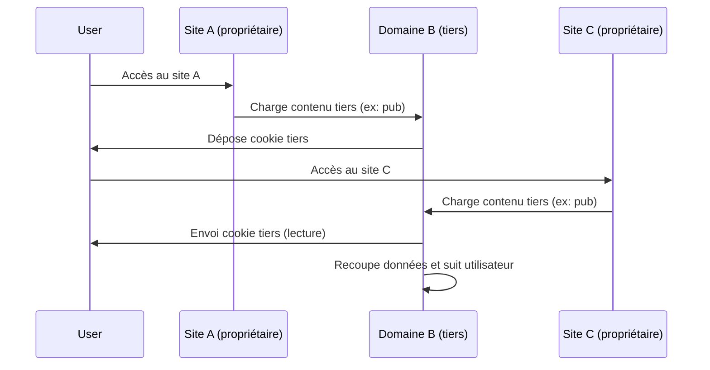

# Article 08-02-01  
## Fonctionnement des cookies tiers dans le tracking

### Introduction  
Les cookies tiers jouent un rôle central dans le suivi des internautes sur le web. Utilisés principalement à des fins publicitaires et analytiques, ils permettent le tracking cross-site, mais leur utilisation soulève d’importantes questions réglementaires liées à la vie privée. Cet article explique le fonctionnement technique des cookies tiers, leur usage dans le tracking, ainsi que les contraintes légales associées.

---

### 1. Qu’est-ce qu’un cookie tiers ?  

Un cookie est un petit fichier stocké par un navigateur à la demande d’un site web, qui contient des informations relatives à l’utilisateur.  
- **Cookie propriétaire (first-party)** : Créé et lu par le site web que l’utilisateur visite directement.  
- **Cookie tiers (third-party)** : Créé par un domaine différent de celui du site visité, souvent via des scripts intégrés (comme des publicités, trackers, ou widgets).  

Ces cookies tiers permettent notamment à des acteurs externes (advertisers, réseaux sociaux) de suivre un même utilisateur sur plusieurs sites.

---

### 2. Fonctionnement des cookies tiers dans le tracking  

#### 2.1 Mécanisme technique  

Lorsqu’un internaute visite un site A, celui-ci peut intégrer des éléments provenant d’un domaine tiers B (ex : une balise publicitaire). Le domaine B dépose alors un cookie sur le navigateur de l’utilisateur. Lors de la visite d’un site C qui utilise également du contenu de B, le cookie tiers est envoyé automatiquement par le navigateur au serveur B, permettant ainsi de recouper et consolider les comportements utilisateurs sur plusieurs sites.  

---

#### 2.2 Exemple concret  

- Sur le site d’un média en ligne (site A), une bannière publicitaire affichée via une régie publicitaire (domaine B) place un cookie tiers.  
- L’utilisateur visite ensuite un site e-commerce (site C) qui utilise la même régie. Le cookie tiers permet à la régie d'associer les visites et d’ajuster la publicité affichée selon le comportement global.  

---

### 3. Enjeux liés aux cookies tiers  

#### 3.1 Suivi inter-sites et profiling utilisateur  
Grâce aux cookies tiers, des profils marketing peuvent être construits, traçant les intérêts et parcours des internautes à travers différents sites, ce qui alimente du ciblage publicitaire précis.  

#### 3.2 Impact sur la privacy et réglementation  
Des règles strictes encadrent le dépôt et la lecture des cookies tiers à cause de leur nature intrusive :  
- **RGPD (Europe)** : nécessite un consentement explicite avant la pose.  
- **Directive ePrivacy** : encadre l’utilisation des cookies via l’obligation d’information et gestion du refus.  
- **Bloqueurs de cookies** : navigateurs comme Safari, Firefox, Chrome limitent ou bloquent progressivement les cookies tiers (ex. Intelligent Tracking Prevention d’Apple).  

---

### 4. Alternatives et évolution  

- Passage progressif vers le **cookieless tracking** avec des solutions basées sur le stockage côté serveur, l’identification par first-party cookies ou des techniques comme la fingerprinting.  
- Initiatives comme la **Privacy Sandbox** de Google cherchent à remplacer les cookies tiers par des mécanismes respectueux de la vie privée.  

---

### 5. Diagramme Mermaid – Schéma simplifié du fonctionnement des cookies tiers  

---

### Sources  

- [CNIL - Cookies et autres traceurs](https://www.cnil.fr/fr/cookies-et-autres-traceurs-quelles-regles-sont-applicables)  
- [GDPR.eu - Cookies & Tracking](https://gdpr.eu/cookies/)  
- [Mozilla Developer Network - HTTP cookies](https://developer.mozilla.org/en-US/docs/Web/HTTP/Cookies)  
- [Google Privacy Sandbox overview](https://privacysandbox.com/)  
- [IAB Europe - Transparency and Consent Framework](https://iabeurope.eu/tcf-2-0/)

---

Le fonctionnement des cookies tiers est au cœur des mécanismes de tracking cross-site et de ciblage publicitaire. La réglementation impose aujourd’hui que leur usage soit transparent et soumis au consentement, tandis que les navigateurs eux-mêmes contribuent à réduire leur impact pour mieux protéger la vie privée des utilisateurs. Comprendre leur fonctionnement est indispensable pour concevoir des stratégies digitales conformes et respectueuses des internautes.