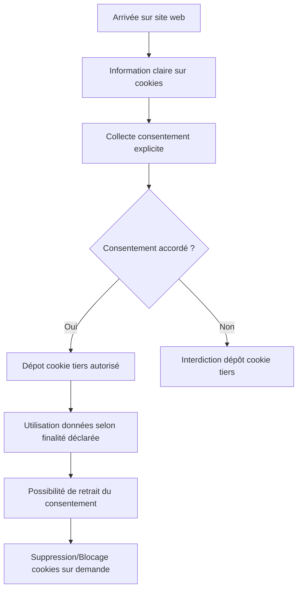

# Article 08-02-02  
## Réglementations en vigueur et respect de la vie privée liées aux cookies tiers

### Introduction  
L’utilisation des cookies tiers, largement employés pour le tracking et la publicité ciblée, est encadrée par plusieurs textes réglementaires visant à protéger la vie privée des internautes. Ces réglementations imposent des obligations strictes aux éditeurs de sites et aux annonceurs concernant la transparence, le consentement, et la gestion des données personnelles. Cet article détaille les principales réglementations en vigueur, leurs implications pratiques et illustre les bonnes pratiques pour garantir leur respect.

---

### 1. Cadre réglementaire principal  

#### 1.1 Le RGPD (Règlement Général sur la Protection des Données)  
Entré en vigueur en mai 2018, le RGPD encadre le traitement des données personnelles des résidents européens. Concernant les cookies tiers, il impose que :  
- Le cookie ne peut être déposé qu’avec le consentement valide, libre, éclairé et spécifique de l’utilisateur (article 6 et 7 RGPD).  
- L’utilisateur doit pouvoir retirer son consentement facilement à tout moment.  
- L’éditeur doit fournir une information claire sur l’usage des cookies et la finalité du traitement.  

#### 1.2 La directive ePrivacy (Directive 2002/58/CE modifiée)  
Souvent appelée directive « cookies », elle complète le RGPD en imposant que :  
- Le consentement préalable (opt-in) est obligatoire pour les cookies non strictement nécessaires (publicité, analytics).  
- L’information doit être donnée de manière visible dès l’arrivée sur le site (bannières, pop-ups).  
- Le consentement doit être obtenu avant le dépôt ou la lecture des cookies.  

---

### 2. Pratiques imposées et outils de conformité  

- **Consent Management Platforms (CMP)** : outils intégrés pour collecter, stocker et gérer le consentement des internautes, permettant le contrôle granulaire (acceptation/refus par catégorie).  
- **Gestion documentaire des traces de consentement** : obligation de conserver les preuves de consentement en cas de contrôle.  
- **Respect de la durée de vie** : cookies déposés doivent avoir une durée de vie limitée, proportionnée aux finalités.  

---

### 3. Jurisprudence et contrôles récents  

- La CNIL a prononcé plusieurs sanctions en cas de non-respect du consentement (ex : amendes pour absence de consentement valide, défaillance du bandeau).  
- De plus en plus de décisions européennes appuient une approche stricte du consentement, rejetant les pratiques par défaut (« cookie walls » contraignants).  

---

### 4. Exemples illustratifs

- **Cas Orange (France, 2020)** : sanction pour dépôt de cookies tiers avant consentement effectif.  
- **Cas Planet49 (Cour de justice de l’UE, 2019)** : le consentement doit être actif, pas pré-coché, et explicite.  

---

### 5. Diagramme Mermaid – Synthèse régulation & cycle de vie des cookies tiers  

---

### 6. Perspectives et évolutions réglementaires  

- L’adoption progressive de normes renforcées autour des **Privacy Sandbox** de Google intègre à terme des mécanismes de tracking sans cookies tiers, conformes à la vie privée.  
- La nouvelle version ePrivacy Regulation (en discussion) pourrait renforcer encore les règles sur le consentement et les traceurs.  

---

### Sources  

- [RGPD – Texte officiel (EU) No 2016/679](https://eur-lex.europa.eu/legal-content/FR/TXT/?uri=CELEX%3A32016R0679)  
- [Directive ePrivacy – 2002/58/CE modifiée](https://eur-lex.europa.eu/legal-content/FR/TXT/?uri=LEGISSUM%3Al14512)  
- [CNIL - Les cookies](https://www.cnil.fr/fr/cookies-les-regles-a-respecter)  
- [CJUE, Arrêt Planet49, 2019](https://curia.europa.eu/juris/document/document.jsf?text=&docid=218462&pageIndex=0&doclang=FR&mode=req&dir=&occ=first&part=1&cid=817962)  
- [IAB Europe – Transparency & Consent Framework](https://iabeurope.eu/transparency-consent-framework/)  
- [EDPB Guidelines on Consent under GDPR](https://edpb.europa.eu/our-work-tools/our-documents/guidelines/guidelines-052020-consent-under-regulation-2016679_en)  

---

Les cookies tiers, indispensables pour de nombreuses stratégies marketing, sont aujourd’hui strictement encadrés par des réglementations européennes qui mettent la transparence et le consentement au cœur des exigences. Les éditeurs doivent s’appuyer sur des outils et procédures robustes pour garantir le respect de la vie privée et éviter risques juridiques et réputationnels.