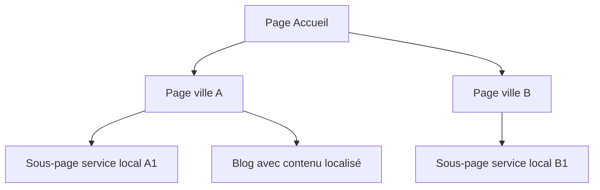

# Article 09-01-01  
## Techniques pour optimiser le référencement local et personnalisé  

### Introduction  
Le référencement local (SEO local) et la personnalisation du contenu sont des leviers puissants pour augmenter la visibilité d'une entreprise ou d’un site sur des requêtes géolocalisées. L’optimisation SEO géographique vise à attirer des clients proches géographiquement et à délivrer un contenu pertinent en fonction de leur localisation et intent web. Cet article décrit les techniques clés pour optimiser un référencement local efficace et personnalisé, fondées sur des bonnes pratiques reconnues et exemples concrets.

---

### 1. Comprendre les spécificités du SEO géographique  

Le référencement local vise à positionner une page ou un site web sur des résultats de recherche liés à une zone géographique précise. Google adapte ses pages de résultats (SERPs) pour intégrer des cartes, listings d’entreprises locales (Google My Business), et résultats personnalisés en fonction de la proximité et du comportement utilisateur.  

---

### 2. Techniques SEO pour le référencement local  

#### 2.1 Optimisation Google My Business (GMB)  
- Créer et revendiquer une fiche GMB complète avec adresse, horaires, téléphone, catégories d’activité, images et posts réguliers.  
- Encourager les avis clients authentiques et répondre aux commentaires.  
- Assurer la cohérence des informations NAP (Name, Address, Phone) sur tous les canaux.  

#### 2.2 Contenu localisé et sémantique géographique  
- Intégrer les noms de lieux, quartiers ou codes postaux dans les titres (balises H1, meta title) et textes.  
- Créer des pages spécifiques pour chaque localité desservie.  
- Utiliser des données structurées Schema.org (LocalBusiness, GeoCoordinates) pour indiquer les informations locales aux moteurs.  

#### 2.3 Optimisation technique locale  
- Assurer la rapidité du site et compatibilité mobile.  
- Créer un sitemap dédié aux pages locales.  
- Utiliser les URLs claires avec inclusion géographique : ex. www.site.com/paris/ ou www.site.com/lyon/  

---

### 3. Personnalisation du référencement par géolocalisation  

#### 3.1 Adaptation du contenu selon la localisation détectée  
- Identifier la position utilisateur via navigateur, IP ou GPS (avec consentement).  
- Afficher des offres, promotions ou contenus adaptés géographiquement.  
- Modifier dynamiquement certains éléments SEO (titres, descriptions) pour augmenter la pertinence locale.  

#### 3.2 Exemples  
- Un site e-commerce affichant les stocks disponibles dans le magasin le plus proche.  
- Un site de réservation de restaurant proposant une page personnalisée selon la ville de l'internaute.  

---

### 4. Exemple de structure SEO locale  

---

### 5. Mesure de la performance locale  

- Suivre les positions sur mots-clés géolocalisés.  
- Analyser les visites issues de recherches locales avec Google Analytics / Piwik Pro.  
- Monitorer les conversions localisées et adapter les stratégies en fonction des comportements.  

---

### Sources  

- [Google My Business Help - Optimize your local listing](https://support.google.com/business/answer/7091)  
- [Moz - The Essential Guide to Local SEO](https://moz.com/learn/seo/local)  
- [Yoast - Local SEO: Complete Guide](https://yoast.com/local-seo/)  
- [Search Engine Journal - SEO Personalization Techniques](https://www.searchenginejournal.com/seo-personalization-techniques/397354/)  
- [Google Developers - Structured Data for Local Business](https://developers.google.com/search/docs/appearance/structured-data/local-business)  

---

Un référencement local efficace combine des optimisations techniques, rédactionnelles et stratégiques ciblant la géolocalisation de l’utilisateur. La personnalisation du contenu renforce la pertinence des résultats pour l’internaute et améliore significativement la conversion locale.
