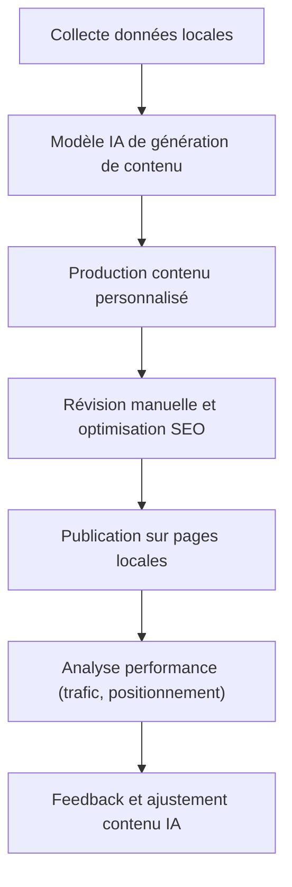

# Article 09-01-02  
## Utilisation du contenu généré par IA pour le SEO local  

### Introduction  
L'intelligence artificielle (IA) transforme la manière dont le contenu est créé, notamment pour le référencement local (SEO local). L’utilisation de contenus générés par IA permet de produire rapidement des textes personnalisés et pertinents pour différentes zones géographiques, facilitant l’optimisation du positionnement sur des requêtes locales. Cet article expose les opportunités, bonnes pratiques et limites de l’intégration de l’IA dans les stratégies SEO locales.

---

### 1. Apport de l’IA dans la création de contenu SEO local  

Les algorithmes d’IA, basés sur des modèles de langage avancés (GPT, BERT...), peuvent générer des contenus adaptés à des zones géographiques spécifiques, en intégrant automatiquement :  
- Les termes locaux (villes, quartiers, points d’intérêt).  
- Des variations sémantiques propres au contexte régional.  
- Des FAQs ciblées sur les besoins spécifiques d’une population locale.  

Cette automatisation réduit le temps et les coûts de production tout en maintenant une large couverture géographique.

---

### 2. Techniques d’utilisation de contenu IA pour le SEO local  

#### 2.1 Génération de pages spécifiques   
Création automatique de pages ciblant différentes localités avec un contenu unique qui incorpore des informations locales spécifiques (ex : horaires, événements, partenariats).  

#### 2.2 Personnalisation dynamique  
Intégration de contenu généré en temps réel selon la localisation de l’utilisateur (via géolocalisation IP ou GPS), améliorant la pertinence perçue et l’expérience utilisateur.  

#### 2.3 Optimisation pour la recherche vocale et mobile  
L’IA permet de construire des contenus plus naturels et conversationnels, répondant aux requêtes vocales fréquentes en local, comme _« Où trouver un plombier à Lyon ? »_.

---

### 3. Exemples concrets  

- **Site de franchise nationale** : génération automatique de descriptions de boutiques dans chaque ville, avec détails spécifiques comme les contacts, services offerts et témoignages locaux.  
- **Blog touristique** : création de guides personnalisés pour différents quartiers, alimentés automatiquement à partir de données locales.  

---

### 4. Attention aux limites et bonnes pratiques  

- **Originalité et pertinence** : le contenu généré doit être révisé pour éviter le duplicate content et s’assurer qu’il apporte une réelle valeur ajoutée.  
- **Qualité rédactionnelle** : vérifier la cohérence, la fluidité et l'adaptation au ton de la marque.  
- **Respect des guidelines Google** : éviter le spam et le contenu abusif généré automatiquement qui peut entraîner des pénalités.  
- **Mise à jour régulière** : le contenu local évolue fréquemment (horaires, réglementation), la génération doit intégrer ces mises à jour.  

---

### 5. Diagramme Mermaid – Processus d’intégration de contenu IA en SEO local  

---

### Sources  

- [Search Engine Journal - Using AI for Local SEO](https://www.searchenginejournal.com/ai-content-local-seo/454306/)  
- [Moz - Local SEO Content Strategies](https://moz.com/blog/local-seo-content-strategies)  
- [Google Search Central - Creating Useful Content](https://developers.google.com/search/docs/fundamentals/creating-useful-content)  
- [Ahrefs - AI Content & SEO in 2024](https://ahrefs.com/blog/ai-content-seo/)  
- [Semrush - AI for Local SEO and Business](https://www.semrush.com/blog/ai-local-seo-business/)  

---

L’intégration du contenu généré par IA dans une stratégie SEO locale offre une réponse scalable à la nécessité de personnalisation et diversité des pages locales. En combinant automatisation et supervision humaine, cette approche permet de maximiser la visibilité sur des requêtes géolocalisées tout en respectant les exigences de qualité et de pertinence fixées par les moteurs de recherche.
