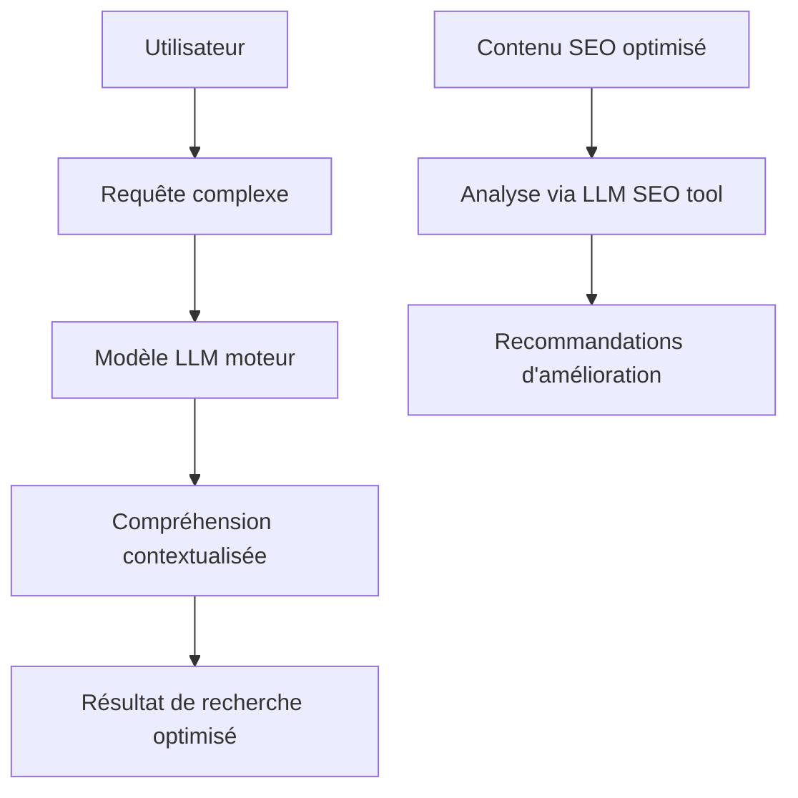

# Article 10-01-01  
## Fonctionnement des LLM et implications pour le SEO  

### Introduction  
Les modèles de langue à grande échelle (Large Language Models – LLM) comme GPT, BERT ou T5 ont profondément transformé la manière dont le traitement automatique du langage naturel (NLP) est réalisé. Ces modèles ont aussi un impact direct sur le SEO, modifiant la compréhension des requêtes utilisateurs ainsi que l’évaluation et la génération des contenus. Cet article décrit le fonctionnement des LLM et leurs implications concrètes pour les stratégies SEO.

---

### 1. Fonctionnement des modèles de langue à grande échelle (LLM)  

#### 1.1 Architecture et principe de base  
Les LLM reposent principalement sur des architectures dites **transformers**, utilisant des mécanismes d’attention pour saisir les relations contextuelles entre les mots dans un texte. En s’entraînant sur des corpus immenses, ces modèles apprennent à prédire le mot suivant, comprendre le sens global, extraire les intentions, et générer un texte cohérent.  

#### 1.2 Entraînement et capacité  
- **Pré-entraînement** : apprentissage sur des milliards de tokens issus de textes divers (Internet, livres, articles).  
- **Fine-tuning** : adaptation spécifique à une tâche (ex : classification, résumé, réponse à questions).  
- Capacité à générer du langage naturel fluide, à contextualiser les requêtes, et à effectuer des tâches complexes (traduction, synthèse, extraction d'information).  

---

### 2. Impact des LLM sur le SEO  

#### 2.1 Amélioration de la compréhension des requêtes  
Les moteurs modernes (ex : Google avec BERT et MUM) utilisent des LLM pour mieux comprendre le contexte, la sémantique et l’intention derrière les requêtes, notamment les requêtes longues ou conversationnelles. Ainsi :  
- Le SEO doit privilégier un **contenu riche, naturel et exhaustif** plutôt que basé sur la répétition mécanique de mots-clés.  
- Les recherches orientées “voice search” ou questions complexes sont mieux traitées.  

#### 2.2 Evolution vers le contenu généré par IA  
Les LLM permettent également la génération automatique de contenu textuel pertinent : fiches produits, articles, descriptions localisées. Toutefois, Google recommande d’éviter les contenus générés uniquement pour manipuler le ranking sans valeur ajoutée réelle (perte de qualité détectée via algorithmie).  

#### 2.3 Analyse et optimisation basées sur LLM  
Des outils SEO intègrent les LLM pour analyser sémantiquement les pages, identifier les lacunes de contenu, et proposer des optimisations ciblées sans devoir analyser manuellement de grandes quantités de données.  

---

### 3. Exemples concrets  

- **Google BERT** : intégré dans le noyau du moteur depuis 2019, améliore la compréhension des prépositions et dépendances dans les requêtes.  
- **MUM (Multitask Unified Model)** : introduit en 2021 et capable de comprendre les requêtes multimodales (texte/image) pour fournir des résultats plus complets.  
- **Outils SEO** comme Surfer SEO ou Clearscope utilisant GPT pour générer des recommandations de contenu ou drafts.  

---

### 4. Diagramme Mermaid – Interaction LLM et SEO  

---

### Sources  

- [Google AI Blog - BERT Explained](https://ai.googleblog.com/2019/10/bert-state-of-art-pre-training-for.html)  
- [Google Blog - Introducing MUM](https://blog.google/products/search/multitask-unified-model-mum/)  
- [Moz - How Large Language Models Impact SEO](https://moz.com/blog/how-llms-impact-seo)  
- [Search Engine Journal - LLM and SEO](https://www.searchenginejournal.com/large-language-models-seo/463214/)  
- [OpenAI GPT-4 Technical Report](https://arxiv.org/abs/2303.08774)  

---

Les LLM transforment la compréhension des moteurs de recherche et obligent les SEO à adopter une approche plus qualitative, centrée sur la richesse sémantique et la pertinence naturelle du contenu. Leur intégration dans les outils SEO facilite l’analyse sémantique et la création assistée, ouvrant de nouvelles perspectives pour optimiser la visibilité digitale.