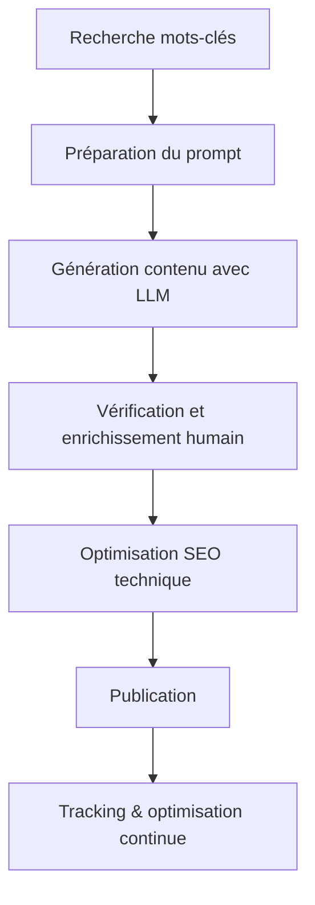

# Article 10-01-02  
## Création de contenu optimisé avec les outils LLM  

### Introduction  
Les outils basés sur les modèles de langue à grande échelle (Large Language Models – LLM) sont devenus des alliés puissants pour la création de contenus optimisés pour le SEO. Leur capacité à comprendre le contexte, générer un langage naturel et structurer des textes de qualité facilite la production rapide et ciblée. Cet article présente les bonnes pratiques pour utiliser ces outils efficacement, en évitant pièges et en maximisant l’impact SEO.

---

### 1. Fonctionnement et capacités des outils LLM pour la création de contenu  

Les LLM comme GPT-4, PaLM, ou LLaMA génèrent du texte à partir d’instructions ou prompts. Ils peuvent :  
- Produire des articles complets, descriptions, FAQ, meta descriptions, titres optimisés.  
- Adapter le style et la tonalité selon les besoins (formel, informatif, persuasif).  
- Intégrer naturellement des mots-clés et expressions synonymes pour couvrir la pertinence sémantique.  

---

### 2. Étapes pour créer un contenu optimisé SEO avec LLM  

#### 2.1 Définir la stratégie et les objectifs  
- Identifier les mots-clés cibles (principal, secondaires).  
- Déterminer le type de contenu attendu (guide, blog, landing page).  
- Fixer les contraintes : longueur, ton, audience.  

#### 2.2 Élaborer un prompt détaillé  
Pour guider l’IA, un prompt clair et précis est indispensable. Exemple :  
_"Rédige un article SEO de 800 mots sur les avantages du vélo électrique, en intégrant les mots-clés ‘vélo électrique’, ‘mobilité durable’ et ‘économie d’énergie’, avec un ton accessible et convaincant."_  

#### 2.3 Génération et enrichissement  
- Générer un premier draft.  
- Relire et enrichir avec données ou exemples spécifiques.  
- Utiliser des outils SEO (ex : Surfer SEO, Clearscope) pour analyser la densité des mots-clés, structure, mots clés LSI (Latent Semantic Indexing).  

#### 2.4 Optimisation technique  
- Veiller à l’optimisation des balises meta (title, description).  
- Structurer le contenu (titres Hn, bullet points).  
- Ajouter des liens internes et externes pertinents.  

---

### 3. Exemple pratique  

Supposons un site d’e-commerce qui souhaite optimiser sa page produit de casque de vélo :  
- Prompt : _"Créer une description produit de 150 mots pour un casque de vélo léger, mettant en avant la sécurité et le confort, en intégrant les mots-clés ‘casque vélo’, ‘sécurité cycliste’, ‘confort casque’."_  
- Le contenu généré peut ensuite être ajusté en intégrant des labels certifiés, avis clients et recommandations d’usage pour enrichir la page.  

---

### 4. Précautions et limites  

- **Vérification humaine** : Les LLM peuvent générer des erreurs factuelles ou répétitives, la relecture est obligatoire.  
- **Éviter le contenu dupliqué** : Chaque page doit avoir un contenu unique et adapté.  
- **Éthique et transparence** : Mentionner l’usage d’IA si pertinent, surtout dans certains secteurs réglementés.  
- **Suivi des performances** : Utiliser analytics pour mesurer l’impact et ajuster.  

---

### 5. Diagramme Mermaid – Workflow de création de contenu SEO avec LLM  

---

### Sources  

- [OpenAI - GPT Usage Guidelines](https://openai.com/policies/usage-policies)  
- [Surfer SEO Blog - How to Use AI for Content Writing](https://surferseo.com/blog/ai-content-writing-seo/)  
- [Search Engine Journal - Best Practices for AI-Generated Content](https://www.searchenginejournal.com/ai-generated-content-guide/455336/)  
- [Moz - SEO Content Strategy with AI](https://moz.com/blog/ai-content-strategy)  
- [Google Search Central - Content Guidelines](https://developers.google.com/search/docs/fundamentals/creating-useful-content)  

---

Les outils LLM offrent un levier puissant pour accélérer et enrichir la création de contenu SEO localisé, pertinent et engageant. En combinant rigueur humaine et automatisation intelligente, ils permettent d’optimiser la visibilité tout en garantissant la pertinence et la qualité du contenu publié.