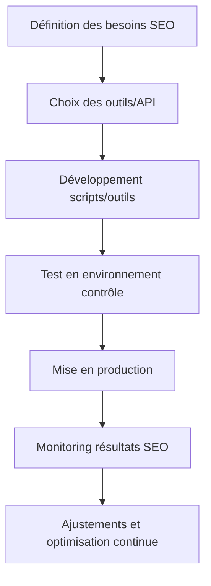

# Article 11-01-01  
## Utilisation d'outils et scripts pour automatiser le SEO  

### Introduction  
L’automatisation du SEO permet de gagner en efficacité, d’assurer une cohérence dans les actions et de gérer à grande échelle des optimisations souvent répétitives. L’usage d’outils spécialisés et de scripts personnalisés offre la possibilité de contrôler, auditer, créer ou modifier du contenu et des balises SEO rapidement et à moindre coût. Cet article présente les méthodes courantes d’automatisation du SEO, ainsi que des exemples concrets pour intégrer ces techniques dans une stratégie digitale.

---

### 1. Pourquoi automatiser certains aspects du SEO ?  

- **Échelle** : gérer des milliers de pages sans intervention manuelle.  
- **Gain de temps** : éviter les tâches répétitives (création de balises, reporting).  
- **Réduction des erreurs humaines** : scripts cohérents et précis.  
- **Réactivité** : déployer rapidement des correctifs SEO ou modifications.  

---

### 2. Outils courants d’automatisation SEO  

| Outil                 | Fonctionnalité principale                         | Exemple d’usage                          |
|-----------------------|-------------------------------------------------|---------------------------------------|
| **Screaming Frog SEO Spider** | Audit de site, extraction de données HTML SEO       | Identification des balises manquantes |
| **Google Search Console API**    | Accès automatisé aux données de performance SEO        | Surveillance des positions et clics   |
| **Ahrefs/SEMrush API**    | Analyse de backlinks, mots-clés, concurrents          | Monitoring de la visibilité concurrentielle |
| **Zapier/Integromat**    | Automatisation de workflows intégrant SEO et marketing | Publication automatique de rapports  |
| **Python / Node.js scripts**  | Scripts personnalisés pour actions SEO variées          | Génération automatique de meta descriptions |

---

### 3. Exemples d’automatisation SEO avec scripts  

#### 3.1 Génération automatique de meta descriptions  
Un script Python peut extraire le contenu principal d’une page (ex : premier paragraphe) et générer une meta description concise adaptée au SEO. Exemple de pseudo-code :  
```python
for url in url_list:
    content = extract_main_content(url)
    meta_desc = content[:150] + "..."
    update_meta_description(url, meta_desc)
```

#### 3.2 Monitoring automatique des erreurs 404  
Utilisation d’un crawler automatisé qui liste les URLs cassées, alerte l’équipe technique et suggère des redirections 301.

#### 3.3 Audit de mots-clés  
Script d’extraction via API SEMrush pour surveiller le positionnement des mots-clés ciblés et générer un rapport hebdomadaire.

---

### 4. Bonnes pratiques  

- **Testez avant de déployer** : vérifier que les scripts n’ont pas d’effet négatif (spam, erreurs).  
- **Respectez les limites API** : quota et politique d’utilisation des fournisseurs.  
- **Documentez et versionnez** vos scripts pour un suivi et maintenance efficaces.  
- **Automatisez par étapes** : commencer par les tâches chronophages les plus simples.  

---

### 5. Diagramme Mermaid – Processus d'automatisation SEO  



---

### Sources  

- [Screaming Frog SEO Spider Documentation](https://www.screamingfrog.co.uk/seo-spider/user-guide/)  
- [Google Search Console API Guide](https://developers.google.com/webmaster-tools/search-console-api-original/)  
- [SEMrush API Overview](https://developer.semrush.com/api/)  
- [Zapier SEO Automation Ideas](https://zapier.com/blog/seo-automation/)  
- [Python SEO Scripts Examples - GitHub](https://github.com/topics/seo)  
- [Moz - Automating SEO](https://moz.com/blog/automation-and-seo)  

---

L’automatisation SEO, via outils et scripts adaptés, permet d’optimiser la visibilité en réduisant le travail manuel. Son implantation méthodique et progressive garantit une meilleure maîtrise technique et une amélioration continue des performances SEO.