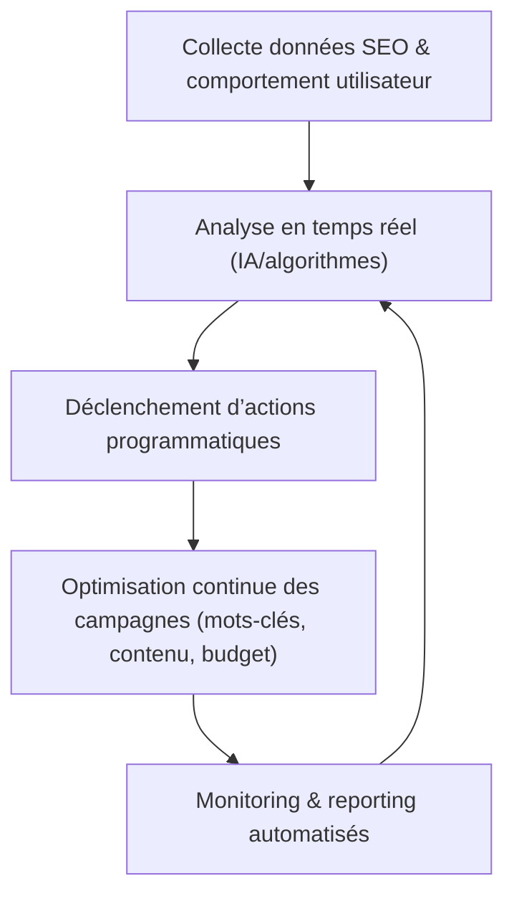

# Article 11-01-02  
## Gestion des campagnes et optimisation programmatique  

### Introduction  
La gestion programmatique des campagnes SEO et marketing automatisées permet d’optimiser les actions à grande échelle en s’appuyant sur des données en temps réel et des algorithmes adaptatifs. Cette approche repose sur des outils et plateformes capables de piloter, analyser et ajuster les campagnes SEO de manière dynamique, maximisant ainsi le ROI tout en réduisant les interventions manuelles. Cet article présente les principes clés, méthodes et exemples concrets d’optimisation programmatique des campagnes SEO.

---

### 1. Qu’est-ce que la gestion programmatique ?  

La gestion programmatique désigne l’utilisation d’automatisations, souvent basées sur des algorithmes d’intelligence artificielle, pour piloter des campagnes marketing ou SEO. Elle inclut :  
- La collecte et analyse en temps réel des données SEO.  
- Le déclenchement automatique d’actions d’optimisation (ajustement mots-clés, budget, contenu).  
- Le suivi continu des performances via des dashboards dynamiques.  

---

### 2. Outils et plateformes clés  

| Outil / Plateforme              | Fonctionnalités principales                      | Cas d’usage typique                   |
|--------------------------------|------------------------------------------------|-------------------------------------|
| **Google Ads/Google Marketing Platform** | Gestion automatique des enchères, ciblage, A/B testing | Optimisation des campagnes SEA complémentaires au SEO |
| **SEMrush/PPCexpo**             | Analyse programmatique des mots-clés et concurrence | Ajustement automatique des mots-clés SEO/SEA  |
| **Tableau / Power BI**          | Visualisation et reporting dynamique des données SEO | Tableau de bord décisionnel en temps réel  |
| **Martech Automation Platforms (ex : Hubspot)** | Automatisation des workflows liés au SEO et marketing de contenu | Scénarios d’envoi, lead nurturing, scoring  |
| **Scripts personnalisés (Python, JavaScript)** | Ajustement et automatisation sur-mesure (création de contenu, monitoring) | Campagnes SEO fortement personnalisées   |

---

### 3. Techniques d’optimisation programmatique  

#### 3.1 Ajustement dynamique des mots-clés  
Sur la base des tendances de recherche et du positionnement, les outils ajustent en temps réel les mots-clés prioritaires à cibler, maximisant l’impact. Par exemple, un script peut désactiver l’optimisation autour d’un mot-clé en baisse et favoriser un terme émergent.  

#### 3.2 A/B Testing automatisé  
Lancer plusieurs versions de pages ou annonces SEO, puis utiliser des algorithmes pour favoriser celles offrant la meilleure performance (taux de clic, taux de conversion).  

#### 3.3 Personnalisation en temps réel  
Modifier dynamiquement le contenu ou les offres présentées en fonction du comportement utilisateur ou de la provenance géographique, renforçant ainsi la pertinence et l’engagement.  

---

### 4. Exemple concret : optimisation d’une campagne SEO locale  

Une entreprise multi-sites peut utiliser une plateforme programmatique pour :  
- Collecter les données de visite et conversion par zone géographique.  
- Automatiser la génération de pages locales avec contenus adaptés.  
- Ajuster quotidiennement les priorités SEO selon les performances régionales.  
- Générer automatiquement des rapports hebdomadaires pour l’équipe.  

---

### 5. Diagramme Mermaid – Processus de gestion programmatique des campagnes SEO  

---

### Sources  

- [Google Marketing Platform - Automation](https://marketingplatform.google.com/about/enterprise/)  
- [SEMrush Blog - Programmatic SEO](https://www.semrush.com/blog/programmatic-seo/)  
- [Search Engine Journal - Programmatic SEO Strategies](https://www.searchenginejournal.com/how-to-do-programmatic-seo/423231/)  
- [Hubspot - Marketing Automation](https://blog.hubspot.com/marketing/marketing-automation)  
- [Tableau - Visual Analytics for SEO](https://www.tableau.com/solutions/seo-analytics)  

---

L’intégration de la gestion programmatique dans les campagnes SEO permet une optimisation fine, rapide et à grande échelle. En automatisant l’analyse des données et la prise de décision, elle facilite l’adaptation aux évolutions du marché et maximise la performance globale des actions digitales.
