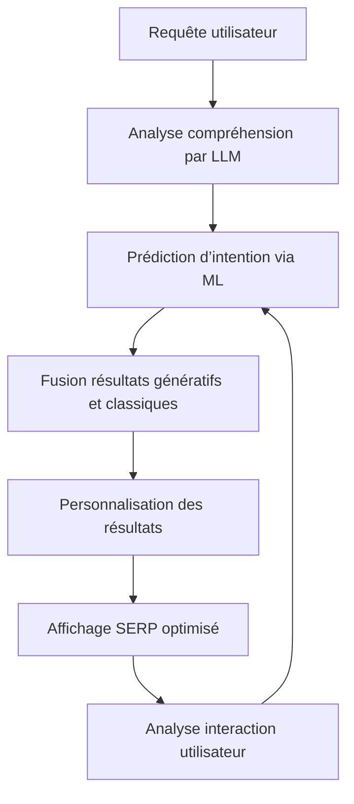

# Article 12-01-01  
## Intégration poussée de l'IA et machine learning dans le search  

### Introduction  
L’intelligence artificielle (IA) et le machine learning (ML) sont désormais intégrés profondément dans le fonctionnement des moteurs de recherche, transformant la manière dont les résultats sont générés, classés et personnalisés. Ces technologies permettent une meilleure compréhension du langage naturel, une prédiction fine des intentions des utilisateurs et une personnalisation adaptative des réponses, ouvrant ainsi la voie à une expérience de recherche plus pertinente et performante.

---

### 1. Fonctionnement et innovations actuelles  

#### 1.1 Compréhension sémantique avancée grâce aux LLM  
Les grands modèles de langue (LLM) comme GPT, BERT ou MUM sont désormais au cœur des moteurs de recherche. Leur capacité à analyser la requête dans son contexte, à interpréter les nuances sémantiques et à prendre en compte des requêtes complexes révolutionne la pertinence des réponses fournies.  

#### 1.2 Recherche prédictive et personnalisée  
Les algorithmes de machine learning exploitent les données historiques de recherche et le comportement utilisateur pour anticiper les besoins, suggérer des résultats avant même que la requête soit finale, et adapter les SERP selon le profil et le contexte.  

#### 1.3 Fusion des résultats traditionnels et génératifs  
Des moteurs comme Google intègrent désormais des éléments de réponse issus d’IA générative (Search Generative Experience – SGE), combinant des informations synthétisées avec les liens classiques vers les sources. Cette hybridation rend les résultats plus digestes et précis.

---

### 2. Applications concrètes dans le SEO  

#### 2.1 Optimisation basée sur l’analyse prédictive  
Les outils SEO intègrent des capacités de machine learning pour prédire les performances des mots-clés, recommander des optimisations adaptées et identifier les opportunités émergentes avant la concurrence.  

#### 2.2 Personnalisation dynamique du contenu  
Le contenu des sites peut être adapté automatiquement en fonction du profil utilisateur, du lieu géographique ou de la phase du tunnel de conversion, améliorant ainsi l’engagement et le taux de conversion.  

#### 2.3 Détection et valorisation du contenu de qualité  
Les algorithmes ML détectent avec finesse la qualité du contenu, valorisant les contenus authentiques, profonds et bien structurés tout en pénalisant les contenus générés de manière abusive ou de faible valeur ajoutée.

---

### 3. Exemples récents  

- **Google MUM (Multitask Unified Model)** : capable de comprendre et générer des réponses complexes multimodales (texte + image) pour enrichir la recherche.  
- **Bing Chat & Microsoft Copilot** : intégration d’IA conversationnelle dans les résultats de recherche, permettant à l’utilisateur d’interagir de manière naturelle et d’obtenir des synthèses instantanées.  
- **Outils SEO comme SurferSEO ou SEMrush** : exploitent le machine learning pour offrir des recommandations de contenu basées sur des analyses statistiques volumineuses.  

---

### 4. Diagramme Mermaid – Fonctionnement intégratif IA & Machine Learning dans la recherche  

---

### Sources  

- [How AI and Machine Learning are Redefining SEO in 2024 - Krotov Studio](https://krotovstudio.com/blog/seo/how-ai-and-machine-learning-are-redefining-seo-in-2024/)  
- [The Future Of SEO: How AI And Machine Learning Are Changing Search - Forbes](https://www.forbes.com/councils/forbesbusinesscouncil/2024/05/08/the-future-of-seo-how-ai-and-machine-learning-are-changing-search/)  
- [Google Blog - Introducing MUM](https://blog.google/products/search/multitask-unified-model-mum/)  
- [TechDogs - Top 5 AI Search Engines Of 2024](https://www.techdogs.com/td-articles/trending-stories/top-5-ai-search-engines-of-2024/)  
- [Salesforce - AI for SEO Guide](https://www.salesforce.com/marketing/ai/seo-guide/)  

---

L’intégration poussée de l’IA et du machine learning transforme les moteurs de recherche en plateformes intelligentes capables d’interpréter en profondeur les besoins des utilisateurs et d’adapter continuellement les résultats. Pour les professionnels du SEO, cela signifie un focus accru sur la qualité, la pertinence contextuelle et l’adaptabilité dynamique des contenus.