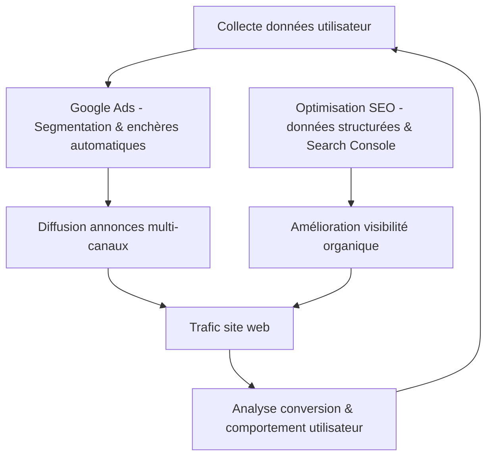

# Article 12-01-02  
## Nouvelles fonctionnalités dans Google Ads et SEO  

### Introduction  
Google Ads et SEO évoluent continuellement pour intégrer de nouvelles fonctionnalités, répondant aux attentes des annonceurs et des spécialistes du référencement. Ces innovations visent à améliorer la pertinence des campagnes, affiner le ciblage, offrir des analyses enrichies, et optimiser l’expérience utilisateur tout au long du parcours d’achat. Ce résumé présente les nouveautés majeures récemment ajoutées à Google Ads et les tendances émergentes dans le SEO.

---

### 1. Nouveautés Google Ads  

#### 1.1 Campagnes Performance Max étendues  
Performance Max, lancée pour gérer automatiquement les campagnes sur tous les canaux Google (YouTube, Display, Search...), a gagné en sophistication :  
- Meilleur contrôle des objectifs d’audience par segmentation avancée.  
- Intégration de signaux d'audience personnalisés et ajustements en temps réel basés sur le machine learning.  
- Rapports détaillés sur l’impact par canal, permettant d’identifier précisément ce qui fonctionne.  

#### 1.2 Annonces immersives et interactives  
Google Ads propose de nouvelles formats d’annonces incluant :  
- **Swipable ads** sur mobile, pour un engagement plus dynamique.  
- Annonces vidéo courtes intégrées aux résultats de recherche.  
- Extensions interactives qui permettent aux utilisateurs de prendre des actions directement à partir de l’annonce (prise de rendez-vous, prise de contact).  

#### 1.3 Automatisation intelligente des enchères  
Google améliore régulièrement ses algorithmes d’enchères automatiques pour maximiser la conversion tout en respectant le CPA cible, grâce à l’intégration de données contextuelles en temps réel (heure, position, appareil).  

---

### 2. Nouvelles évolutions côté SEO  

#### 2.1 Intégration des données structurées étendue  
Google renforce le rôle des données structurées (Schema.org) pour enrichir les résultats (rich snippets). Nouveaux types :  
- FAQ, Q&A enrichies.  
- Résultats enrichis pour les produits avec informations de stock en temps réel.  

#### 2.2 Insights Search Console améliorés  
Google Search Console propose désormais :  
- Analyse d’intention plus fine sur les requêtes (transactionnelle, informationnelle...).  
- Cartographie des nouvelles pages indexées en temps quasi réel.  
- Recommandations SEO basées sur un apprentissage automatique.  

#### 2.3 SEO Local et Google Business Profile optimisés  
- Ajout d’options pour gérer directement depuis GSC les informations locales (horaires, événements).  
- Plus grande visibilité des avis clients et réponses rapides intégrées au Knowledge Panel.  

---

### 3. Exemple concret d’utilisation combinée Ads & SEO  

Une PME e-commerce utilise Performance Max pour capter des prospects sur YouTube et Search tout en affinant le ciblage grâce aux rapports d’audience. Simultanément, l’optimisation SEO s’appuie sur les données Search Console pour renforcer les pages produits avec FAQ enrichies et données structurées, améliorant la visibilité organique et la conversion.  

---

### 4. Diagramme Mermaid – Interaction nouveautés Google Ads et SEO  

---

### Sources  

- [Google Ads Help - Performance Max updates 2024](https://support.google.com/google-ads/answer/10597321)  
- [Search Engine Journal - Google Ads New Features 2024](https://www.searchenginejournal.com/google-ads-new-features-2024/488258/)  
- [Google Search Central Blog - Latest SEO tools updates](https://developers.google.com/search/blog/2024)  
- [Moz - SEO Trends & Data Structured](https://moz.com/blog/seo-trends-2024)  
- [Google Business Profile Updates 2024](https://support.google.com/business/answer/4596773)  

---

Les innovations intégrées dans Google Ads et SEO offrent des outils puissants pour une stratégie digitale plus fine et efficace. Leur exploitation combinée, via automatisation et enrichissement des données, ouvre des perspectives de croissance et d’amélioration continue des performances marketing.