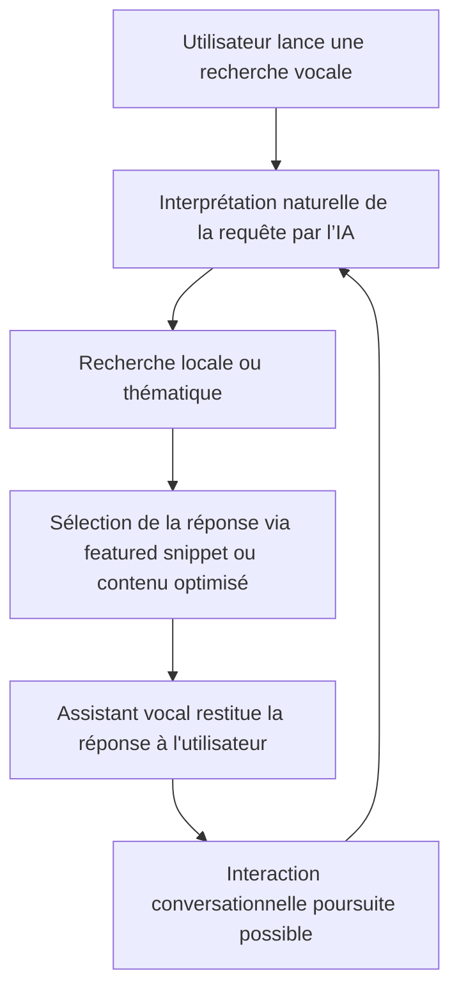

# Article 12-02-01  
## Impact des recherches vocales et conversationnelles  

### Introduction  
Les recherches vocales et conversationnelles influencent profondément le comportement des utilisateurs et la manière dont les moteurs de recherche interprètent les requêtes. Avec la démocratisation des assistants virtuels (Google Assistant, Siri, Alexa), les requêtes dites « vocales » représentent une part croissante du trafic de recherche. Comprendre leur impact est indispensable pour adapter le SEO et anticiper les évolutions du référencement naturel.

---

### 1. Caractéristiques des recherches vocales et conversationnelles  

- **Formulation naturelle et longue** : Les requêtes vocales sont souvent plus longues, formulées en phrases complètes ou questions naturelles (« Où est la meilleure pizzeria près de chez moi ? »).  
- **Recherche locale accrue** : La majorité des requêtes vocales ont une intention locale claire, liée à un besoin immédiat.  
- **Recherche multi-turn** : Les assistants conversationnels gèrent des interactions successives pour affiner la réponse.  
- **Usage mobile et multitâche** : Facilitée par les smartphones et objets connectés, la recherche vocale accompagne des usages multitâches (ex. cuisiner tout en posant des questions).  

---

### 2. Conséquences pour le SEO  

#### 2.1 Adaptation du contenu aux requêtes conversationnelles  
Le contenu doit intégrer un langage naturel, privilégier les questions-réponses (FAQ), et utiliser des phrases complètes. Les mots-clés doivent inclure des expressions longues et interrogatives (mots interrogatifs, prépositions).  

#### 2.2 Importance renforcée du SEO local  
Optimiser les pages Google Business Profile, intégrer des mentions géographiques précises et répondre aux questions fréquentes sur les horaires, services, et directions.  

#### 2.3 Optimisation pour les featured snippets (extraits optimisés)  
Les assistants vocaux s’appuient souvent sur les featured snippets pour fournir leurs réponses. Structurez le contenu pour favoriser ces extraits (paragraphes courts, listes, définitions claires).  

---

### 3. Exemples concrets  

- **Secteur restauration** : Un restaurant optimisant son site avec des FAQ type « Quels sont vos horaires d’ouverture ? » ou « Proposez-vous des plats végétariens ? » sera mieux référencé pour les requêtes vocales.  
- **E-commerce** : Les fiches produits avec des descriptions naturelles et des questions liées aux usages (« ce produit est-il compatible avec iPhone ? ») améliorent le référencement vocal.  

---

### 4. Adaptation technique  

- **Données structurées** : Utilisation intensive de Schema.org pour marquer FAQ, localBusiness, produit, événements, etc.  
- **Vitesse de chargement** : Un facteur encore plus critique dans un contexte de recherche vocale souvent mobile.  
- **Compatibilité mobile & accessibilité** : Assurer une navigation fluide sur mobile et via commandes vocales.  

---

### 5. Diagramme Mermaid – Interaction recherche vocale, utilisateur et SEO  

---

### Sources  

- [Think with Google - The rise of voice search](https://www.thinkwithgoogle.com/consumer-insights/consumer-trends/voice-assistant-usage-trends/)  
- [Search Engine Journal - Voice Search SEO Best Practices](https://www.searchenginejournal.com/voice-search-seo-best-practices/442765/)  
- [Google Search Central - Optimize for voice search](https://developers.google.com/search/blog/2023/voice-search-optimization)  
- [Moz - How to Optimize for Voice Search in 2024](https://moz.com/blog/voice-search-optimization-2024)  
- [Backlinko - Voice Search SEO: The Complete Guide](https://backlinko.com/voice-search-seo)  

---

La montée en puissance des recherches vocales exige d’adapter stratégies SEO à un langage plus conversationnel, axé sur une compréhension fine des intentions et contextes locaux. Exploiter les nouveaux formats, telles que les featured snippets, et soigner les données structurées permettent d’améliorer le référencement vocal et d’anticiper les usages futurs de la recherche.