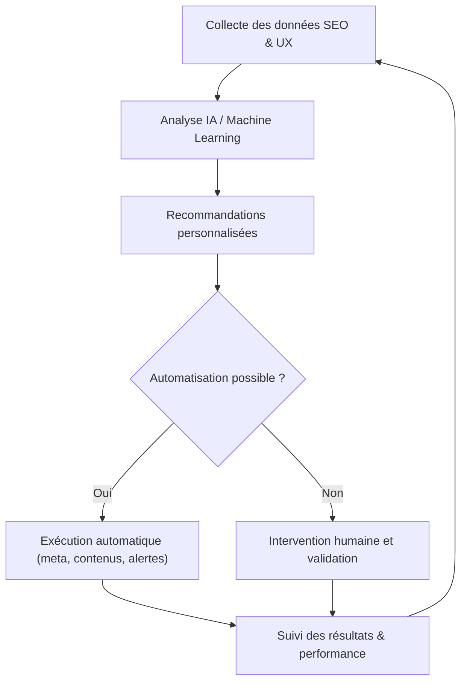

# Article 12-02-02  
## Évolution des outils d'analyse et d'optimisation  

### Introduction  
Les outils d’analyse et d’optimisation SEO continuent de se transformer rapidement, intégrant davantage d’intelligence artificielle, d’automatisation et d’analyse prédictive. Cette évolution permet aux spécialistes SEO de prendre des décisions plus précises, réactives et stratégiques. Cet article expose les tendances majeures dans le développement de ces outils, leurs nouvelles fonctionnalités, ainsi que des exemples concrets d’usage.

---

### 1. Tendances majeures dans les outils SEO  

#### 1.1 Intégration de l’intelligence artificielle et machine learning  
Les plateformes analysent désormais les données de recherche, comportement utilisateur, et performances avec des algorithmes avancés qui détectent automatiquement :  
- Les signaux d’intention derrière les requêtes.  
- Les opportunités d’amélioration ciblées (mots-clés, contenus).  
- Les comportements anormaux ou évolutions rapides du marché.  

#### 1.2 Automatisation des recommandations et actions  
Certains outils ne s’arrêtent plus à la simple analyse : ils automatisent directement certaines optimisations, comme la génération de meta descriptions, la refonte de balises, ou encore le monitoring précis via alertes intelligentes.  

#### 1.3 Analyse prédictive et scénarios prospectifs  
Grâce à de gros volumes de données historiques et temps réel, ces outils anticipent les tendances SEO, prédisent l’évolution des mots-clés, et simulent l'impact d’actions avant déploiement.  

---

### 2. Nouveautés fonctionnelles concrètes  

| Fonctionnalité            | Exemple d’outil             | Description                               |
|--------------------------|----------------------------|-------------------------------------------|
| Audit SEO automatisé      | **SEMrush Site Audit**, **Ahrefs Site Audit** | Rapports immédiats avec priorisation des corrections à réaliser |
| Recommandations basées IA | **SurferSEO**, **Clearscope**                  | Analyse sémantique du contenu et suggestions d’amélioration précises |
| Analyse comportementale  | **Google Analytics 4**, **Hotjar**              | Corrélation entre SEO et expérience utilisateur avec heatmaps et parcours |
| Intégration prédictive    | **Moz Pro**, **BrightEdge**                      | Prévisions d’impact des optimisations sur le trafic et conversions |
| Automatisation des tâches | Scripts Python, Zapier Workflow                   | Mise à jour automatique de reporting, alertes, ou contenus SEO |

---

### 3. Exemples d’utilisation avancée  

- **Optimisation de contenu dynamique via SurferSEO** : un site e-commerce ajuste en temps réel ses descriptions produits en fonction des tendances détectées par l’outil (mots-clés émergents, langage utilisateur).  
- **Monitoring proactif avec Web Analyse et alertes personnalisées** : notifications automatiques en cas de chute brusque de trafic sur une page SEO clé, permettant d’intervenir rapidement.  
- **Utilisation de modèles prédictifs BrightEdge** pour hiérarchiser les axes d’optimisation prioritaires selon leur impact potentiel sur le positionnement et le chiffre d’affaires.  

---

### 4. Diagramme Mermaid – Cycle d’analyse et optimisation SEO automatisée  

---

### Sources  

- [SEMrush Blog - SEO Tools Trends 2024](https://www.semrush.com/blog/seo-tools-trends-2024/)  
- [Moz - The Future of SEO Tools](https://moz.com/blog/future-of-seo-tools)  
- [Ahrefs - SEO Tool Updates 2024](https://ahrefs.com/blog/seo-updates/)  
- [Google Analytics Blog - GA4 Features](https://www.blog.google/products/marketingplatform/analytics/introducing-google-analytics-4/)  
- [SurferSEO - Optimizing with AI](https://surferseo.com/blog/ai-content-optimization/)  

---

Les outils d’analyse et optimisation SEO s’appuient de plus en plus sur l’intelligence artificielle et l’automatisation pour offrir des solutions complètes, allant de l’audit à l’exécution des améliorations. Leur maîtrise favorise un SEO proactif, réactif et efficace, appuyé par des recommandations fiables et la capacité à anticiper l’évolution constante des moteurs de recherche.
